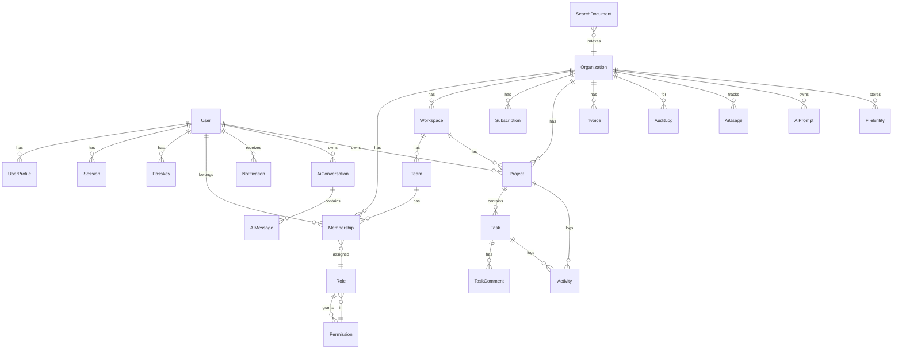

# AI Prompt Templates

Copy and paste these prompts into your AI coding assistant to generate production-ready code that matches the starter kit patterns exactly.

---

## "Add a new feature module"

> Add a new module called `[Feature]` to the SaaS starter kit.
> 
> It should have:
> - Entity `[Entity]` with columns: `id` (uuid PK), `organizationId` (uuid, indexed), `[fields]`, `createdAt`, `updatedAt`
> - Service with CRUD methods scoped by `organizationId`
> - Controller with routes: `GET /[feature]`, `GET /[feature]/:id`, `POST /[feature]`, `PATCH /[feature]/:id`, `DELETE /[feature]/:id`
> - DTOs for create/update with `class-validator` decorators
> - Permission enum values: `[feature].read`, `[feature].create`, `[feature].update`, `[feature].delete`
> - Frontend page at `/dashboard/[feature]` with list and create form
> 
> Follow the existing patterns in `apps/api/src/project/` and `apps/web/src/app/dashboard/projects/`.
> 
> Rules:
> - All entities must have `organizationId` + index
> - Use `@Permissions(...)` on protected routes
> - Use `@CurrentOrganization()` and `@AuthUser()` param decorators
> - Return `ok(data)` or `fail(message)` from `@shared/response`
> - Frontend uses `api.get/post/patch/del` from `lib/api-client.ts`
> - Gate UI with `<Can permission="...">`

---

## "Add a new API endpoint to existing module"

> Add endpoint `GET /api/[module]/stats` to `[Module]Controller`.
> 
> It should return aggregated stats for the current organization.
> Use `@Permissions("[resource].read")` and `@CurrentOrganization()`.
> Return `ok({ total, active, ... }, "Stats")`.
> Follow the pattern in `apps/api/src/dashboard/dashboard.controller.ts`.

---

## "Add a new frontend page"

> Add a new page `/dashboard/[feature]` to the SaaS starter kit.
> 
> It should:
> - Fetch data from `/api/[feature]` using `api.get()` from `lib/api-client.ts`
> - Display a list with TanStack Query
> - Have a create form using React Hook Form + Zod
> - Gate the page with `<Can permission={Permission.[FEATURE]_READ}>`
> - Follow the patterns in `apps/web/src/app/dashboard/projects/page.tsx`

---

## "Fix a bug"

> Bug: [description]
> 
> Context:
> - The app uses NestJS with global `JwtAuthGuard` + `PermissionGuard` in `AppModule`
> - Public routes need `@Public()` decorator from `core/guards/jwt-auth.guard`
> - Protected routes need `@Permissions(...)` from `core/guards/permission.guard`
> - Never use `@UseGuards(JwtAuthGuard)` — it's redundant
> - All API responses use `{ success, message, data, meta }` envelope
> - Frontend `api-client.ts` auto-attaches Bearer token and `x-organization-id`
> - Multi-tenant: every entity has `organizationId`, scope all queries by it

---

## "Add a new permission"

> Add a new permission `[resource].[action]` to the SaaS starter kit.
> 
> Steps:
> 1. Add enum value to `Permission` in `packages/shared/src/enums.ts`
> 2. Add it to the appropriate role arrays in `ROLE_PERMISSIONS`
> 3. Apply `@Permissions(Permission.[RESOURCE]_[ACTION])` to the controller method
> 4. In the frontend, gate UI with `<Can permission={Permission.[RESOURCE]_[ACTION]}>`

---

## "Add a new email template"

> Add a new transactional email template to the SaaS starter kit.
> 
> The email system is in `apps/api/src/email/`. Templates are rendered with Handlebars.
> Jobs are enqueued via BullMQ using `this.queues.add(QUEUE_NAMES.EMAIL, "send", payload)`.
> Follow the pattern in the existing email service and consumer.

---

## "Add Stripe webhook"

> Add a Stripe webhook endpoint to the SaaS starter kit.
> 
> Requirements:
> - Route: `POST /api/billing/webhooks/stripe`
> - Mark it `@Public()` so Stripe can call it without auth
> - Use `request.rawBody()` / `request.text()` for signature verification — do NOT add body-parsing middleware before it
> - Handle `invoice.paid`, `invoice.payment_failed`, `customer.subscription.updated`
> - Update `Subscription` entity and enqueue `QUEUE_NAMES.EMAIL` for receipts
> - Follow patterns in `apps/api/src/billing/billing.controller.ts`


---

# API Specification

Base URL: `/api` (proxied by Nginx to `:3001`). Auth: `Authorization: Bearer <accessToken>`.
Tenant-scoped routes also require `x-organization-id: <orgId>`.

## Auth (`/auth`)
| Method | Path | Auth | Body | Description |
|--------|------|------|------|-------------|
| POST | /auth/register | – | {email, password, firstName?, lastName?} | Register (sends verify email) |
| POST | /auth/login | – | {email, password, device?} | Login (returns access+refresh; 2FA challenge if enabled) |
| POST | /auth/refresh | – | {refreshToken} | Rotate tokens |
| POST | /auth/logout | ✅ | {refreshToken} | Revoke current session |
| POST | /auth/logout-all | ✅ | – | Revoke all sessions |
| GET | /auth/verify-email?token= | – | – | Verify email |
| POST | /auth/forgot-password | – | {email} | Send reset link |
| POST | /auth/reset-password | – | {token, password} | Reset password |
| POST | /auth/change-password | ✅ | {current, next} | Change password |
| GET | /auth/me | ✅ | – | Current user + permissions |
| GET | /auth/google/login | – | – | Google OAuth start |
| GET | /auth/google/callback | – | code | Google OAuth callback |
| POST | /auth/security/2fa/enable | ✅ | – | Start TOTP (returns secret+otpauth) |
| POST | /auth/security/2fa/confirm | ✅ | {code} | Confirm TOTP |
| POST | /auth/security/2fa/disable | ✅ | – | Disable 2FA |
| GET | /auth/security/sessions | ✅ | – | List active sessions |
| DELETE | /auth/security/sessions/:id | ✅ | – | Revoke a session |
| GET/POST/DELETE | /auth/security/passkeys | ✅ | – | Passkey (WebAuthn) CRUD |

## Organizations & RBAC (`/organizations`) — requires `x-organization-id` + permission
| Method | Path | Permission |
|--------|------|-----------|
| GET | /organizations/mine | authenticated |
| POST | /organizations | authenticated (creates owner membership) |
| GET | /organizations/:id | org.read |
| PATCH | /organizations/:id | org.update |
| GET | /organizations/:id/members | org.read |
| POST | /organizations/:id/members/invite | org.members.invite |
| POST | /organizations/:id/members/:mid/role | org.members.role |
| DELETE | /organizations/:id/members/:mid | org.members.remove |
| GET/POST | /organizations/:id/workspaces | org.read / org.update |
| POST | /organizations/:id/teams | org.update |

## Billing (`/billing`)
| Method | Path | Permission |
|--------|------|-----------|
| GET | /billing/subscription | org.billing.read |
| POST | /billing/subscription/plan | org.billing.manage |
| POST | /billing/subscription/cancel | org.billing.manage |
| GET | /billing/invoices | org.billing.read |
| GET/POST | /billing/coupons | platform.billing.manage |

## Users (`/users`)
| Method | Path | Permission |
|--------|------|-----------|
| GET | /users/me/profile | authenticated |
| PATCH | /users/me/profile | user.update |
| PATCH | /users/me/preferences | user.update |
| PATCH | /users/me/notification-settings | user.update |
| POST | /users/me/avatar | user.update |
| POST | /users/me/deactivate | user.update |
| DELETE | /users/:id | user.delete |

## Projects (`/projects`)
| Method | Path | Permission |
|--------|------|-----------|
| GET | /projects | project.read (paginated) |
| POST | /projects | project.create (free-tier cap enforced) |
| GET | /projects/:id/tasks | project.task.read |
| POST | /projects/:id/tasks | project.task.create |
| POST | /projects/tasks/:taskId/comments | project.task.read |

## AI (`/ai`)
| Method | Path | Permission |
|--------|------|-----------|
| POST | /ai/chat | ai.chat (enqueues BullMQ job, tracks usage/cost) |
| GET | /ai/conversations | ai.chat |
| GET | /ai/usage | ai.usage.read |
| GET/POST | /ai/prompts | ai.prompt.manage |

## Notifications / Search / Dashboard / Admin
- `/notifications` — list, unread-count, mark-read, read-all (`notification.read`)
- `/search/global` — global FTS with filters/pagination (`org.read`)
- `/dashboard/org` `/dashboard/revenue` `/dashboard/users` `/dashboard/ai-spend`
- `/admin/stats` `/admin/users` `/admin/organizations` `/admin/feature-flags`

All responses: `{ success, message, data, meta }`. Pagination meta: `{ page, limit, total, totalPages }`.


---

# Authentication & Security Flow

## Login (credentials)
```
Client ──POST /auth/login──▶ AuthService.login()
        ◀── { accessToken, refreshToken, expiresIn, user } ──
Store tokens (Zustand + localStorage); send accessToken as Bearer.
```

- **Access token**: short-lived (15m), stateless JWT carrying `sub`, `email`,
  `organizationId`, `perms` (resolved RBAC set), `sid` (session jti).
- **Refresh token**: long-lived (30d), stored in `sessions` table (auditable) and
  mirrored in Redis (`refresh:<jti>`) for instant revocation.

## Token refresh
```
Client ──POST /auth/refresh {refreshToken}──▶ verify JWT + Redis lookup
        ◀── new access+refresh pair ──
```
The web `api-client` auto-refreshes once on `401`.

## Logout / Session revocation
- `POST /auth/logout` deletes the `sessions` row + Redis key (single device).
- `POST /auth/logout-all` revokes every active session for the user.
- `DELETE /auth/security/sessions/:id` revokes a specific device.

## Email verification
Register → `emailVerificationToken` set → email link → `GET /auth/verify-email`
sets `emailVerified=true`, `status=active`.

## Forgot / Reset password
`forgot-password` issues a TTL `passwordResetToken` + email; `reset-password`
verifies and updates `passwordHash`.

## Social login (Google)
`/auth/google/login` → Google consent → `/auth/google/callback` exchanges code,
upserts the user (`provider=google`, `emailVerified=true`), issues tokens.

## Two-Factor (TOTP)
`2fa/enable` generates a `speakeasy` secret; `2fa/confirm` verifies the code and
sets `twoFactorEnabled=true`. On login, if 2FA is enabled the API returns
`{ twoFactorRequired: true, userId }` and the client must complete the TOTP step
before tokens are issued.

## Passkeys (WebAuthn)
`/auth/security/passkeys` CRUD. Credential public keys are stored; challenge/verify
uses `@simplewebauthn` in production (storage scaffold provided).

## Secrets & headers
- `JWT_SECRET` signs both tokens (HS256). Keep server-only.
- `x-organization-id` selects the active tenant for every scoped route.
- Passwords hashed with `bcryptjs` (cost 10).
- Rate limiting via `@nestjs/throttler` (global).


---

# Production Deployment Guide

## Architecture

```
Internet ──▶ Nginx (80) ──▶ /  → web (Next.js :3000)
                     └────▶ /api, /docs, /health → api (NestJS :3001)
                                          │
                              ┌───────────┼───────────┐
                            Postgres     Redis       (BullMQ workers in same api process)
```

Nginx terminates requests and routes `/api` to the NestJS API. The API process also
hosts the BullMQ workers (queues + consumers in one deployment for simplicity; split
into a dedicated worker service at scale).

## Option A — Docker Compose (single host)

```bash
cp .env.example .env
# Set: JWT_SECRET (strong), DB_*, REDIS_*, EMAIL_PROVIDER, FRONTEND_URL, NEXT_PUBLIC_API_URL
docker compose up -d
```

This starts postgres, redis, api (runs migrations then boots), web, and nginx.
The app is served on `http://<host>`.

## Option B — PM2 (bare metal / VPS)

```bash
npm ci
npm run build --workspaces
npm run migrate --workspace apps/api
pm2 start ecosystem.config.js
pm2 save
pm2 startup   # enable boot-start
```

`ecosystem.config.js` runs `saas-api` (cluster mode) and `saas-web` with memory
restarts. Put Nginx in front:

```nginx
server {
  location /api/ { proxy_pass http://127.0.0.1:3001/api/; }
  location /docs { proxy_pass http://127.0.0.1:3001/docs; }
  location / { proxy_pass http://127.0.0.1:3000; }
}
```

## CI/CD (GitHub Actions)

`.github/workflows/ci.yml` runs on every push/PR:
1. `npm ci`
2. Typecheck + build + lint for `apps/api` and `apps/web`
3. Builds Docker images

For CD, add a deploy job (e.g. SSH into the host and `docker compose pull && up -d`,
or push images to a registry and roll out). Secrets: `JWT_SECRET`, `DB_*`,
`OPENAI_API_KEY`, `STRIPE_SECRET_KEY`, etc.

## Hardening checklist

- [ ] Strong `JWT_SECRET`; different per environment.
- [ ] PostgreSQL with TLS; least-privilege DB user.
- [ ] Redis with `requirepass` (set `REDIS_PASSWORD`); use a private network.
- [ ] `EMAIL_PROVIDER` wired to a real provider (SMTP/Resend/SES).
- [ ] `STORAGE_PROVIDER=aws` (S3/MinIO) instead of local disk for files.
- [ ] HTTPS via Certbot/`listen 443 ssl` in Nginx.
- [ ] Real Stripe webhooks (`STRIPE_WEBHOOK_SECRET`) to sync subscription status.
- [ ] Rate limits tuned in `@nestjs/throttler` (global) per route if needed.
- [ ] Sentry/OTel for error + request logging in production.
- [ ] Backups for Postgres (`pg_dump` / managed snapshots).

## MySQL variant

Set `DB_TYPE=mysql` and `DB_PORT=3306`. The migration uses PostgreSQL DDL; for MySQL
generate a MySQL-flavored migration (`DB_TYPE=mysql npm run migration:generate`) or
adapt `apps/api/src/database/migrations/0000000000001-initial-schema.ts`
(uuid → char(36), timestamptz → datetime, jsonb → json, GIN → FULLTEXT).

## OpenAPI spec export

The API is documented with Swagger at `/docs`. To export a JSON spec for AI tools or client generation:

```bash
# Start the API, then:
curl http://localhost:3001/docs-json > docs/openapi.json
curl http://localhost:3001/docs > docs/swagger.html
```

Commit `docs/openapi.json` to the repo so AI assistants can inspect the exact API surface without running the server.


---

# Entity Relationship Diagram



## Key relationships

| Entity | Relations |
|--------|-----------|
| User | 1:1 UserProfile, 1:N Session, 1:N Passkey, 1:N Membership, 1:N Notification, 1:N AiConversation |
| Organization | 1:N Membership, 1:N Workspace, 1:N Subscription, 1:N Project, 1:N Invoice, 1:N AuditLog, 1:N File |
| Workspace | 1:N Team, 1:N Project |
| Team | 1:N Membership |
| Membership | N:1 Role, N:1 User, N:1 Organization, N:1 Team |
| Role | N:N Permission (via `role_permissions`) |
| Project | 1:N Task |
| Task | 1:N TaskComment, 1:N Activity |
| AiConversation | 1:N AiMessage |


---

# New Module Template

Copy these files when adding a new feature module. Replace `Feature`/`feature` with your resource name (e.g. `Invoice`, `invoices`).

## 1. Entity: `apps/api/src/feature/entities/feature.entity.ts`

```ts
import { Column, Entity, Index } from "typeorm";
import { BaseEntity } from "../../common/entities/base.entity";

@Entity("features")
@Index(["organizationId", "createdAt"])
export class Feature extends BaseEntity {
  @Index()
  @Column({ type: "uuid" })
  organizationId!: string;

  @Column({ type: "varchar", length: 160 })
  name!: string;

  @Column({ type: "text", nullable: true })
  description?: string | null;

  @Column({ type: "varchar", length: 32, default: "active" })
  status!: string;
}
```

## 2. Module: `apps/api/src/feature/feature.module.ts`

```ts
import { Module } from "@nestjs/common";
import { TypeOrmModule } from "@nestjs/typeorm";
import { Feature } from "./entities/feature.entity";
import { FeatureService } from "./feature.service";
import { FeatureController } from "./feature.controller";
import { TenantModule } from "../tenant/tenant.module";
import { BillingModule } from "../billing/billing.module";
import { AuditModule } from "../audit/audit.module";

@Module({
  imports: [
    TypeOrmModule.forFeature([Feature]),
    TenantModule,
    BillingModule,
    AuditModule,
  ],
  providers: [FeatureService],
  controllers: [FeatureController],
  exports: [FeatureService],
})
export class FeatureModule {}
```

## 3. Service: `apps/api/src/feature/feature.service.ts`

```ts
import { Injectable, NotFoundException, BusinessException } from "@nestjs/common";
import { InjectRepository } from "@nestjs/typeorm";
import { Repository } from "typeorm";
import { Feature } from "./entities/feature.entity";
import { RbacService } from "../tenant/rbac.service";
import { AuditService } from "../audit/audit.service";
import { Permission } from "@shared/enums";
import { parsePagination, toPaginated, PaginationParams } from "../core/pagination";

@Injectable()
export class FeatureService {
  constructor(
    @InjectRepository(Feature) private readonly repo: Repository<Feature>,
    private readonly rbac: RbacService,
    private readonly audit: AuditService,
  ) {}

  async list(organizationId: string, userId: string, query: Record<string, any>) {
    await this.rbac.assertPermission(userId, organizationId, Permission.FEATURE_READ);
    const p: PaginationParams = parsePagination(query);
    const qb = this.repo.createQueryBuilder("f").where("f.organizationId = :orgId", { orgId: organizationId });
    if (p.search) qb.andWhere("f.name ILIKE :q", { q: `%${p.search}%` });
    const [items, total] = await qb.orderBy(`f.${p.sort?.field ?? "createdAt"}`, p.sort?.order ?? "DESC").skip(p.skip).take(p.limit).getManyAndCount();
    return toPaginated(items, total, p);
  }

  async create(organizationId: string, userId: string, dto: { name: string; description?: string }) {
    await this.rbac.assertPermission(userId, organizationId, Permission.FEATURE_CREATE);
    const item = await this.repo.save(this.repo.create({ organizationId, ...dto }));
    await this.audit.record("feature", "created", { actorId: userId, organizationId }, { entityType: "feature", entityId: item.id });
    return item;
  }

  async findOne(id: string, organizationId: string) {
    const item = await this.repo.findOne({ where: { id, organizationId } });
    if (!item) throw new NotFoundException("Not found");
    return item;
  }

  async update(id: string, organizationId: string, userId: string, patch: Partial<Feature>) {
    const item = await this.findOne(id, organizationId);
    await this.rbac.assertPermission(userId, organizationId, Permission.FEATURE_UPDATE);
    Object.assign(item, patch, { updatedAt: new Date() });
    return this.repo.save(item);
  }

  async remove(id: string, organizationId: string) {
    const item = await this.findOne(id, organizationId);
    await this.repo.remove(item);
    return { deleted: true };
  }
}
```

## 4. Controller: `apps/api/src/feature/feature.controller.ts`

```ts
import { Controller, Get, Post, Body, Patch, Param, UseGuards } from "@nestjs/common";
import { AuthUser, CurrentOrganization } from "../core/guards/jwt-auth.guard";
import { PermissionGuard, Permissions } from "../core/guards/permission.guard";
import { AccessTokenPayload } from "../auth/services/token.service";
import { FeatureService } from "./feature.service";
import { Permission } from "@shared/enums";

class CreateFeatureDto {
  name!: string;
  description?: string;
}

@Controller("features")
@UseGuards(PermissionGuard)
export class FeatureController {
  constructor(private readonly svc: FeatureService) {}

  @Get()
  @Permissions(Permission.FEATURE_READ)
  async list(@CurrentOrganization() orgId: string, @AuthUser() user: AccessTokenPayload) {
    return this.svc.list(orgId!, user.sub, {} as any);
  }

  @Post()
  @Permissions(Permission.FEATURE_CREATE)
  async create(@CurrentOrganization() orgId: string, @AuthUser() user: AccessTokenPayload, @Body() dto: CreateFeatureDto) {
    return this.svc.create(orgId!, user.sub, dto);
  }

  @Get(":id")
  @Permissions(Permission.FEATURE_READ)
  async get(@Param("id") id: string, @CurrentOrganization() orgId: string) {
    return this.svc.findOne(id, orgId!);
  }

  @Patch(":id")
  @Permissions(Permission.FEATURE_UPDATE)
  async update(@Param("id") id: string, @CurrentOrganization() orgId: string, @AuthUser() user: AccessTokenPayload, @Body() patch: any) {
    return this.svc.update(id, orgId!, user.sub, patch);
  }

  @Delete(":id")
  @Permissions(Permission.FEATURE_DELETE)
  async remove(@Param("id") id: string, @CurrentOrganization() orgId: string) {
    return this.svc.remove(id, orgId!);
  }
}
```

## 5. Register in `apps/api/src/app.module.ts`

```ts
import { FeatureModule } from "./feature/feature.module";

@Module({
  imports: [
    // ... existing imports
    FeatureModule,
  ],
})
export class AppModule {}
```

## 6. Add permissions to `packages/shared/src/enums.ts`

```ts
export enum Permission {
  // ... existing permissions
  FEATURE_READ = "feature.read",
  FEATURE_CREATE = "feature.create",
  FEATURE_UPDATE = "feature.update",
  FEATURE_DELETE = "feature.delete",
}
```

## 7. Grant permissions to roles in `ROLE_PERMISSIONS`

Add the new `Permission.FEATURE_*` values to the role arrays that should have access (e.g. `ORG_OWNER`, `ADMIN`, `MEMBER`).

## 8. Frontend page: `apps/web/src/app/dashboard/features/page.tsx`

```tsx
"use client";

import { useQuery, useMutation, useQueryClient } from "@tanstack/react-query";
import { api } from "@/lib/api-client";
import { useAuthStore } from "@/lib/auth-store";
import { Can } from "@/components/providers";
import { Permission } from "@shared/enums";
import { Button } from "@/components/ui/button";
import { Input } from "@/components/ui/input";
import { Card, CardContent, CardHeader, CardTitle } from "@/components/ui/card";
import { Table, TableBody, TableCell, TableHead, TableHeader, TableRow } from "@/components/ui/table";

interface FeatureItem { id: string; name: string; description: string | null; status: string; }

export default function FeaturesPage() {
  const activeOrgId = useAuthStore((s) => s.activeOrgId)!;
  const qc = useQueryClient();
  const [name, setName] = useState("");
  const [error, setError] = useState<string | null>(null);

  const { data, isLoading } = useQuery({
    queryKey: ["features", activeOrgId],
    queryFn: () => api.get<{ items: FeatureItem[] }>("/api/features", { organizationId: activeOrgId }),
    enabled: !!activeOrgId,
  });

  const create = useMutation({
    mutationFn: () => api.post<FeatureItem>("/api/features", { name, description: "" }, { organizationId: activeOrgId }),
    onSuccess: () => { setName(""); setError(null); qc.invalidateQueries({ queryKey: ["features", activeOrgId] }); },
    onError: (e: any) => setError(e?.message ?? "Failed"),
  });

  const items = data?.items ?? [];

  return (
    <div>
      <h1 className="text-2xl font-semibold mb-4">Features</h1>

      <Can permission={Permission.FEATURE_CREATE}>
        <Card className="mb-4">
          <CardHeader><CardTitle className="text-base">New feature</CardTitle></CardHeader>
          <CardContent className="flex gap-2 flex-wrap">
            <Input placeholder="Name" value={name} onChange={(e) => setName(e.target.value)} className="max-w-xs" />
            <Button onClick={() => create.mutate()} disabled={!name.trim() || create.isPending}>Add</Button>
          </CardContent>
          {error && <p className="px-6 pb-4 text-sm text-destructive">{error}</p>}
        </Card>
      </Can>

      <Card>
        <CardContent className="pt-6">
          {isLoading ? <p className="text-sm text-muted-foreground">Loading…</p> : (
            <Table>
              <TableHeader><TableRow><TableHead>Name</TableHead><TableHead>Status</TableHead></TableRow></TableHeader>
              <TableBody>
                {items.map((i) => (
                  <TableRow key={i.id}>
                    <TableCell className="font-medium">{i.name}</TableCell>
                    <TableCell><span className="text-xs bg-secondary px-2 py-1 rounded">{i.status}</span></TableCell>
                  </TableRow>
                ))}
              </TableBody>
            </Table>
          )}
        </CardContent>
      </Card>
    </div>
  );
}
```

## 9. Run migration

```bash
npm run migration:generate --workspace apps/api -- name=AddFeatures
npm run migrate --workspace apps/api
```


---

# Multi-Tenancy Architecture

## Layers

1. **Organization** — top-level tenant. Every tenant-scoped row carries
   `organizationId`. Billing, memberships, projects, files, AI usage, audit logs
   all hang off it.
2. **Workspace** — belongs to an organization; groups projects/data.
3. **Team** — belongs to a workspace; groups members with shared access.
4. **Membership** — links `User ↔ Organization` (and optionally `Workspace`/`Team`)
   with a `role` and `status` (invited/active/suspended).

## Tenant isolation

- **Every query is scoped by `organizationId`** in the service layer. There is no
  shared/global data path — the `x-organization-id` header is required by
  `PermissionGuard` for any protected, scoped route.
- `RbacService` resolves permissions *within* an organization, so the same user
  can be an `owner` in one org and a `viewer` in another.
- Audit logs record `organizationId` so activity is traceable per tenant.

## Organization switching

The client stores the selected org id (Zustand `activeOrgId`) and sends it via the
`x-organization-id` header. The org switcher in the dashboard header calls
`setActiveOrg()`. The backend never trusts a client-supplied org for *data* access
beyond verifying the user is an `active` member.

## Invitations

`tenant.inviteMember` creates a `membership` with `status=invited` +
`invitationToken`, emails the invite, and `acceptInvitation` flips it to `active`
and binds the invited user's id.

## Membership & roles

`membership.role` references a `Role` (one of 6 system roles seeded by
`RbacSeeder`). Permissions are resolved via `role_permissions`. Custom per-org
roles can be added with `organizationId` set.

## Adding a tenant-scoped feature

1. Entity has `organizationId` column + index.
2. Service methods take `organizationId` and scope all queries.
3. Controller applies `@Permissions(...)` (PermissionGuard requires `x-organization-id`).
4. Frontend sends `organizationId` via `api` helper and gates UI with `<Can>`.


---

# Reusable Code Patterns

Copy these patterns to extend the kit for any SaaS product.

## 1. New RBAC-protected endpoint
```ts
@Post("widgets")
@Permissions(Permission.PROJECT_CREATE) // or your new perm
async create(@CurrentOrganization() orgId: string, @AuthUser() user: AccessTokenPayload, @Body() dto: CreateDto) {
  return this.service.create({ organizationId: orgId!, userId: user.sub, ...dto });
}
```
- Add the permission to `Permission` enum in `packages/shared/src/enums.ts`.
- Grant it in `ROLE_PERMISSIONS` for the relevant roles.
- Guard requires `x-organization-id`; frontend sends it via `api.post(path, body, { organizationId })`.

## 2. New TypeORM entity + migration
```ts
@Entity("widgets")
export class Widget extends BaseEntity {
  @Index() @Column({ type: "uuid" }) organizationId!: string;
  @Column({ type: "varchar", length: 160 }) name!: string;
}
```
Generate the migration: `npm run migration:generate --workspace apps/api -- name=AddWidgets`
(uses `src/config/typeorm-cli.ts`). Migrations run on boot via docker-compose.

## 3. Standard response + pagination
```ts
const p = parsePagination(query);
const [items, total] = await repo.findAndCount({ skip: p.skip, take: p.limit });
return ok(toPaginated(items, total, p), "Listed"); // from @shared/response
```
The `ResponseInterceptor` wraps any return value in `{ success, message, data, meta }`.

## 4. Background job (BullMQ)
```ts
// enqueue
await this.queues.add(QUEUE_NAMES.EMAIL, "send", payload, { attempts: 3 });
// consume
@Processor("email") class EmailConsumer extends WorkerHost {
  async process(job: Job) { /* deliver */ }
}
```
Register the queue in `workers/worker.module.ts`.

## 5. Audit logging
```ts
await this.audit.record("project", "created", { actorId: user.sub, organizationId }, {
  entityType: "project", entityId: project.id, oldValue, newValue,
});
```
`AuditService` is global — inject it anywhere.

## 6. Frontend data fetching
```ts
const { data } = useQuery({
  queryKey: ["projects", orgId],
  queryFn: () => api.get("/api/projects", { organizationId: orgId, params: { limit: 50 } }),
  enabled: !!orgId,
});
```
`api` auto-attaches the Bearer token, `x-organization-id`, and refreshes on 401.

## 7. UI authorization
```tsx
<Can permission={Permission.PROJECT_CREATE}>
  <Button>New project</Button>
</Can>
```
or imperatively: `useAuthStore.getState().hasPermission(Permission.PROJECT_CREATE)`.

## 8. Standard envelope contract
Always return `{ success, message, data, meta }` (see `@shared/response`). Both
backend `ok()`/`fail()` and the frontend `api-client.unwrap()` rely on it.


---

# RBAC Permission Matrix

Roles are resolved at runtime from `membership.role` → `role.permissions`. `super_admin`
bypasses all guards (defined in `RbacSeeder` + `ROLE_PERMISSIONS` in `packages/shared`).

| Permission | super_admin | org_owner | admin | manager | member | viewer |
|-----------|:--:|:--:|:--:|:--:|:--:|:--:|
| platform.read | ✅ | | | | | |
| platform.manage | ✅ | | | | | |
| platform.users.manage | ✅ | | | | | |
| platform.orgs.manage | ✅ | | | | | |
| platform.billing.manage | ✅ | | | | | |
| platform.feature_flags | ✅ | | | | | |
| org.read | ✅ | ✅ | ✅ | ✅ | ✅ | ✅ |
| org.update | ✅ | ✅ | ✅ | | | |
| org.delete | ✅ | ✅ | | | | |
| org.members.invite | ✅ | ✅ | ✅ | ✅ | | |
| org.members.remove | ✅ | ✅ | ✅ | | | |
| org.members.role | ✅ | ✅ | ✅ | | | |
| org.billing.read | ✅ | ✅ | ✅ | | | |
| org.billing.manage | ✅ | ✅ | ✅ | | | |
| org.settings.manage | ✅ | ✅ | ✅ | | | |
| user.read | ✅ | ✅ | ✅ | ✅ | ✅ | ✅ |
| user.update | ✅ | ✅ | ✅ | ✅ | ✅ | |
| user.delete | ✅ | ✅ | | | | |
| project.read | ✅ | ✅ | ✅ | ✅ | ✅ | ✅ |
| project.create | ✅ | ✅ | ✅ | ✅ | ✅ | |
| project.update | ✅ | ✅ | ✅ | ✅ | ✅ | |
| project.delete | ✅ | ✅ | ✅ | ✅ | | |
| project.task.* | ✅ | ✅ | ✅ | ✅ | ✅ | ✅(read) |
| ai.chat | ✅ | ✅ | ✅ | ✅ | ✅ | ✅ |
| ai.assistant | ✅ | ✅ | ✅ | ✅ | ✅ | |
| ai.prompt.manage | ✅ | ✅ | ✅ | | | |
| ai.usage.read | ✅ | ✅ | ✅ | | | |
| file.read | ✅ | ✅ | ✅ | ✅ | ✅ | ✅ |
| file.upload | ✅ | ✅ | ✅ | ✅ | ✅ | |
| file.delete | ✅ | ✅ | ✅ | | | |
| audit.read | ✅ | ✅ | ✅ | | | |
| notification.read | ✅ | ✅ | ✅ | ✅ | ✅ | ✅ |
| notification.manage | ✅ | ✅ | ✅ | | | |
| dashboard.read | ✅ | ✅ | ✅ | ✅ | ✅ | ✅ |
| analytics.revenue.read | ✅ | ✅ | ✅ | | | |
| analytics.user.read | ✅ | ✅ | ✅ | ✅ | | |

## How it works

- Backend: `@Permissions(...)` + `PermissionGuard` (per route) resolves
  `RbacService.getUserPermissions(userId, organizationId)`.
- Frontend: `<Can permission="...">` component and `useAuthStore.hasPermission()` hide UI.
- Add a permission: add to `Permission` enum in `packages/shared`, grant it in
  `ROLE_PERMISSIONS`, and protect the route with `@Permissions(...)`.


---

# Documentation

This folder contains the deliverables for the SaaS Starter Kit.

| Document | Contents |
|----------|----------|
| [ERD.md](./ERD.md) | Entity relationship diagram (Mermaid) + relationship table |
| [RBAC.md](./RBAC.md) | Role-based access control permission matrix (6 roles) + how it works |
| [API.md](./API.md) | Full API specification (auth, orgs, billing, users, projects, AI, notifications, search, dashboard, admin) |
| [AUTH_FLOW.md](./AUTH_FLOW.md) | Authentication & security flow (login, refresh, 2FA, passkeys, social, sessions) |
| [MULTITENANT.md](./MULTITENANT.md) | Multi-tenancy architecture (org/workspace/team/membership, isolation, switching) |
| [PATTERNS.md](./PATTERNS.md) | Reusable code patterns for extending the kit |
| [DEPLOYMENT.md](./DEPLOYMENT.md) | Production deployment guide (Docker, PM2, Nginx, CI/CD, hardening) |
| [AI.md](../AI.md) | AI coding context — architecture, patterns, guard rules, do-nots |
| [AI_PROMPTS.md](./AI_PROMPTS.md) | Ready-to-use prompt templates for vibe coding |
| [MODULE_TEMPLATE.md](./MODULE_TEMPLATE.md) | Copy-paste skeletons for new backend/frontend modules |

Supporting specs live at the repo root: `README.md`, `AGENTS.md` (if present),
`docker-compose.yml`, `Dockerfile.api`, `Dockerfile.web`, `nginx/default.conf`,
`ecosystem.config.js`, `.github/workflows/ci.yml`, `.cursorrules`.


---

# API Specification

**Version:** 1.0 (Draft)
**Date Generated:** 2025-07-31
**Source:** `saas-starter-kit` repository — all controller files under `apps/api/src/**/*.controller.ts`
**Author:** Generated via reverse-engineering from codebase

---

## 1. GENERAL CONVENTIONS

| Convention | Value |
|------------|-------|
| **Base URL** | `http://localhost:3001` (dev) — production behind Nginx |
| **Global Prefix** | `/api` (set via `process.env.API_PREFIX`, default `api`) |
| **Authentication** | JWT Bearer token in `Authorization` header |
| **Tenant Header** | `x-organization-id` for tenant-scoped routes |
| **Response Envelope** | `{ success: boolean, message: string, data: T | null, meta?: ApiMeta | null }` |
| **Error Envelope** | `{ success: false, message: string, data: { code?: string } | null, meta: null }` |
| **Rate Limit** | 120 requests per 60 seconds globally |
| **Validation** | `class-validator` with `ValidationPipe` (whitelist: true, transform: true) |

**Source:** `apps/api/src/main.ts`, `apps/api/src/app.module.ts`, `apps/api/src/core/response/response.interceptor.ts`, `apps/api/src/core/exception/exception.filter.ts`

---

## 2. AUTH MODULE (`api/auth`)

### 2.1 Register
- **Method:** `POST`
- **Path:** `/api/auth/register`
- **Auth:** Public
- **Request Body:** `RegisterDto` — `email` (string, required), `password` (string, required)
- **Response:** `{ user: { id: string, email: string, status: UserStatus } }`
- **Errors:** `400` (Invalid input), `409` (Email taken — inferred from BusinessException pattern)

**Source:** `apps/api/src/auth/auth.controller.ts:42-47`

### 2.2 Login
- **Method:** `POST`
- **Path:** `/api/auth/login`
- **Auth:** Public
- **Request Body:** `LoginDto` — `email` (string, required), `password` (string, required)
- **Response (Success):** `{ accessToken, refreshToken, expiresIn }`
- **Response (2FA Required):** `{ twoFactorRequired: true, userId: string }`
- **Errors:** `400` (Invalid credentials), `401` (2FA required — business response)

**Source:** `apps/api/src/auth/auth.controller.ts:49-62`

### 2.3 Refresh Token
- **Method:** `POST`
- **Path:** `/api/auth/refresh`
- **Auth:** None
- **Request Body:** `RefreshDto` — `refreshToken` (string, required)
- **Response:** `{ accessToken, refreshToken, expiresIn }`
- **Errors:** `401` (Invalid/expired refresh token)

**Source:** `apps/api/src/auth/auth.controller.ts:64-68`

### 2.4 Logout
- **Method:** `POST`
- **Path:** `/api/auth/logout`
- **Auth:** None
- **Request Body:** `RefreshDto` — `refreshToken` (string, required)
- **Response:** `{ loggedOut: true }`
- **Errors:** `401` (Invalid token)

**Source:** `apps/api/src/auth/auth.controller.ts:70-75`

### 2.5 Logout All Sessions
- **Method:** `POST`
- **Path:** `/api/auth/logout-all`
- **Auth:** JWT required
- **Response:** `{ loggedOut: true }`
- **Errors:** `401`

**Source:** `apps/api/src/auth/auth.controller.ts:77-81`

### 2.6 Verify Email
- **Method:** `GET`
- **Path:** `/api/auth/verify-email`
- **Auth:** Public
- **Query Param:** `token` (string, required)
- **Response:** HTTP 302 redirect to `{FRONTEND_URL}/login?verified=1`

**Source:** `apps/api/src/auth/auth.controller.ts:83-88`

### 2.7 Forgot Password
- **Method:** `POST`
- **Path:** `/api/auth/forgot-password`
- **Auth:** Public
- **Request Body:** `ForgotPasswordDto` — `email` (string, required)
- **Response:** `{ message: "If the email exists, a reset link was sent." }`

**Source:** `apps/api/src/auth/auth.controller.ts:90-96`

### 2.8 Reset Password
- **Method:** `POST`
- **Path:** `/api/auth/reset-password`
- **Auth:** Public
- **Request Body:** `ResetPasswordDto` — `token` (string, required), `password` (string, required)
- **Response:** `{ message: "Password updated" }`
- **Errors:** `400` (Invalid/expired token)

**Source:** `apps/api/src/auth/auth.controller.ts:98-104`

### 2.9 Change Password
- **Method:** `POST`
- **Path:** `/api/auth/change-password`
- **Auth:** JWT required
- **Request Body:** `ChangePasswordDto` — `current` (string, required), `next` (string, required)
- **Response:** `{ message: "Password changed" }`
- **Errors:** `400` (Invalid current password), `401`

**Source:** `apps/api/src/auth/auth.controller.ts:106-110`

### 2.10 Get Current User (`me`)
- **Method:** `GET`
- **Path:** `/api/auth/me`
- **Auth:** JWT required
- **Headers:** `x-organization-id` (optional but resolves permissions if present)
- **Response:** `{ id: string, email: string, organizationId: string | null, permissions: Permission[] }`
- **Errors:** `401`

**Source:** `apps/api/src/auth/auth.controller.ts:112-128`

### 2.11 Enable 2FA (TOTP)
- **Method:** `POST`
- **Path:** `/api/auth/security/2fa/enable`
- **Auth:** JWT required
- **Response:** TOTP setup data
- **Errors:** `401`

**Source:** `apps/api/src/auth/security.controller.ts:43-46`

### 2.12 Confirm 2FA
- **Method:** `POST`
- **Path:** `/api/auth/security/2fa/confirm`
- **Auth:** JWT required
- **Request Body:** `TotpConfirmDto` — `code` (string, required)
- **Response:** `{ enabled: true }`
- **Errors:** `400`, `401`

**Source:** `apps/api/src/auth/security.controller.ts:48-53`

### 2.13 Disable 2FA
- **Method:** `POST`
- **Path:** `/api/auth/security/2fa/disable`
- **Auth:** JWT required
- **Response:** `{ disabled: true }`
- **Errors:** `400`, `401`

**Source:** `apps/api/src/auth/security.controller.ts:55-60`

### 2.14 List Sessions
- **Method:** `GET`
- **Path:** `/api/auth/security/sessions`
- **Auth:** JWT required
- **Response:** Array of session objects: `id`, `deviceName`, `deviceType`, `browser`, `os`, `ipAddress`, `location`, `current`, `createdAt`, `expiresAt`
- **Errors:** `401`

**Source:** `apps/api/src/auth/security.controller.ts:62-80`

### 2.15 Revoke Session
- **Method:** `DELETE`
- **Path:** `/api/auth/security/sessions/:id`
- **Auth:** JWT required
- **Response:** `{ revoked: true }`
- **Errors:** `401`, `403`, `404`

**Source:** `apps/api/src/auth/security.controller.ts:82-87`

### 2.16 Revoke Other Sessions
- **Method:** `DELETE`
- **Path:** `/api/auth/security/sessions`
- **Auth:** JWT required
- **Response:** `{ revoked: true }`
- **Errors:** `401`

**Source:** `apps/api/src/auth/security.controller.ts:89-96`

### 2.17 List Passkeys
- **Method:** `GET`
- **Path:** `/api/auth/security/passkeys`
- **Auth:** JWT required
- **Response:** Array of `{ id, deviceName, createdAt, lastUsedAt }`
- **Errors:** `401`

**Source:** `apps/api/src/auth/security.controller.ts:98-102`

### 2.18 Add Passkey
- **Method:** `POST`
- **Path:** `/api/auth/security/passkeys`
- **Auth:** JWT required
- **Request Body:** `PasskeyRegisterDto` — `credentialId` (string, required), `publicKey` (string, required), `deviceName` (string, optional), `transports` (string, optional), `counter` (number, required)
- **Response:** `{ id: string }`
- **Errors:** `400`, `401`

**Source:** `apps/api/src/auth/security.controller.ts:104-115`

### 2.19 Remove Passkey
- **Method:** `DELETE`
- **Path:** `/api/auth/security/passkeys/:id`
- **Auth:** JWT required
- **Response:** `{ removed: true }`
- **Errors:** `401`, `404`

**Source:** `apps/api/src/auth/security.controller.ts:117-122`

### 2.20 Google OAuth Redirect
- **Method:** `GET`
- **Path:** `/api/auth/google/login`
- **Auth:** Public
- **Response:** HTTP 302 redirect to Google OAuth consent screen
- **Errors:** `500` if `GOOGLE_CLIENT_ID` is unconfigured

**Source:** `apps/api/src/auth/google.controller.ts:24-34`

### 2.21 Google OAuth Callback
- **Method:** `GET`
- **Path:** `/api/auth/google/callback`
- **Auth:** Public
- **Query Param:** `code` (string, required)
- **Response:** HTTP 302 redirect to `{FRONTEND_URL}/oauth/callback?access=<token>&refresh=<token>`
- **Errors:** `500` if token exchange fails

**Source:** `apps/api/src/auth/google.controller.ts:36-55`

---

## 3. TENANT / ORGANIZATION MODULE (`api/organizations`)

### 3.1 List My Organizations
- **Method:** `GET`
- **Path:** `/api/organizations/mine`
- **Auth:** JWT required
- **Response:** Array of organization objects
- **Errors:** `401`

**Source:** `apps/api/src/tenant/tenant.controller.ts:46-49`

### 3.2 Create Organization
- **Method:** `POST`
- **Path:** `/api/organizations`
- **Auth:** JWT required
- **Request Body:** `{ name: string (required), slug?: string }`
- **Response:** Organization object
- **Errors:** `400`, `409` (slug conflict), `401`

**Source:** `apps/api/src/tenant/tenant.controller.ts:51-54`

### 3.3 Get Organization
- **Method:** `GET`
- **Path:** `/api/organizations/:id`
- **Auth:** JWT + Permission(`org.read`) + Tenant context
- **Response:** Organization object
- **Errors:** `401`, `403`, `404`

**Source:** `apps/api/src/tenant/tenant.controller.ts:56-60`

### 3.4 Update Organization
- **Method:** `PATCH`
- **Path:** `/api/organizations/:id`
- **Auth:** JWT + Permission(`org.update`) + Tenant context
- **Request Body:** `any` (untyped)
- **Response:** Updated organization object
- **Errors:** `401`, `403`, `404`

**Source:** `apps/api/src/tenant/tenant.controller.ts:62-66`

### 3.5 List Members
- **Method:** `GET`
- **Path:** `/api/organizations/:id/members`
- **Auth:** JWT + Permission(`org.read`) + Tenant context
- **Response:** Array of membership/user objects
- **Errors:** `401`, `403`, `404`

**Source:** `apps/api/src/tenant/tenant.controller.ts:68-72`

### 3.6 Invite Member
- **Method:** `POST`
- **Path:** `/api/organizations/:id/members/invite`
- **Auth:** JWT + Permission(`org.members.invite`) + Tenant context
- **Request Body:** `{ email: string (required, email format), role: RoleName (required) }`
- **Response:** Membership invitation object
- **Errors:** `400`, `403`, `409` (already member)

**Source:** `apps/api/src/tenant/tenant.controller.ts:74-78`

### 3.7 Change Member Role
- **Method:** `POST`
- **Path:** `/api/organizations/:id/members/:mid/role`
- **Auth:** JWT + Permission(`org.members.role`) + Tenant context
- **Request Body:** `{ role: RoleName (required) }`
- **Response:** `{ updated: true }`
- **Errors:** `400`, `403`, `404`

**Source:** `apps/api/src/tenant/tenant.controller.ts:80-85`

### 3.8 Remove Member
- **Method:** `DELETE`
- **Path:** `/api/organizations/:id/members/:mid`
- **Auth:** JWT + Permission(`org.members.remove`) + Tenant context
- **Response:** `{ removed: true }`
- **Errors:** `403`, `404`

**Source:** `apps/api/src/tenant/tenant.controller.ts:87-92`

### 3.9 List Workspaces
- **Method:** `GET`
- **Path:** `/api/organizations/:id/workspaces`
- **Auth:** JWT + Permission(`org.read`) + Tenant context
- **Response:** Array of workspace objects
- **Errors:** `401`, `403`, `404`

**Source:** `apps/api/src/tenant/tenant.controller.ts:94-98`

### 3.10 Create Workspace
- **Method:** `POST`
- **Path:** `/api/organizations/:id/workspaces`
- **Auth:** JWT + Permission(`org.update`) + Tenant context
- **Request Body:** `{ name: string (required) }`
- **Response:** Workspace object
- **Errors:** `400`, `403`

**Source:** `apps/api/src/tenant/tenant.controller.ts:100-104`

### 3.11 Create Team
- **Method:** `POST`
- **Path:** `/api/organizations/:id/teams`
- **Auth:** JWT + Permission(`org.update`) + Tenant context
- **Request Body:** `{ workspaceId: string (required), name: string (required) }`
- **Response:** Team object
- **Errors:** `400`, `403`, `404`

**Source:** `apps/api/src/tenant/tenant.controller.ts:106-110`

---

## 4. USER MODULE (`api/users`)

### 4.1 Get My Profile
- **Method:** `GET`
- **Path:** `/api/users/me/profile`
- **Auth:** JWT required
- **Response:** User profile object
- **Errors:** `401`

**Source:** `apps/api/src/user/user.controller.ts:11-14`

### 4.2 Update My Profile
- **Method:** `PATCH`
- **Path:** `/api/users/me/profile`
- **Auth:** JWT required
- **Request Body:** `any` (untyped)
- **Response:** Updated profile object
- **Errors:** `400`, `401`

**Source:** `apps/api/src/user/user.controller.ts:16-19`

### 4.3 Update My Preferences
- **Method:** `PATCH`
- **Path:** `/api/users/me/preferences`
- **Auth:** JWT required
- **Request Body:** `Record<string, unknown>`
- **Response:** Updated preferences object
- **Errors:** `400`, `401`

**Source:** `apps/api/src/user/user.controller.ts:21-24`

### 4.4 Update My Notification Settings
- **Method:** `PATCH`
- **Path:** `/api/users/me/notification-settings`
- **Auth:** JWT required
- **Request Body:** `Record<string, unknown>`
- **Response:** Updated notification settings object
- **Errors:** `400`, `401`

**Source:** `apps/api/src/user/user.controller.ts:26-29`

### 4.5 Set Avatar
- **Method:** `POST`
- **Path:** `/api/users/me/avatar`
- **Auth:** JWT required
- **Request Body:** `{ avatarUrl: string }`
- **Response:** Updated user object
- **Errors:** `400`, `401`

**Source:** `apps/api/src/user/user.controller.ts:31-34`

### 4.6 Deactivate Account
- **Method:** `POST`
- **Path:** `/api/users/me/deactivate`
- **Auth:** JWT required
- **Response:** `{ deactivated: true }`
- **Errors:** `401`

**Source:** `apps/api/src/user/user.controller.ts:36-40`

### 4.7 Delete User
- **Method:** `DELETE`
- **Path:** `/api/users/:id`
- **Auth:** JWT required
- **Response:** `{ deleted: true }`
- **Errors:** `403`, `404`, `401`

**Source:** `apps/api/src/user/user.controller.ts:42-46`

---

## 5. PROJECT MODULE (`api/projects`)

### 5.1 List Projects
- **Method:** `GET`
- **Path:** `/api/projects`
- **Auth:** JWT + Permission(`project.read`) + Tenant context
- **Query Params:** Pagination/filter/search via `Record<string, any>`
- **Response:** Paginated project list
- **Errors:** `401`, `403`

**Source:** `apps/api/src/project/project.controller.ts:31-35`

### 5.2 Create Project
- **Method:** `POST`
- **Path:** `/api/projects`
- **Auth:** JWT + Permission(`project.create`) + Tenant context
- **Request Body:** `{ name: string (required), description?: string, workspaceId?: string }`
- **Response:** Created project object
- **Errors:** `400`, `403`

**Source:** `apps/api/src/project/project.controller.ts:37-41`

### 5.3 List Tasks for Project
- **Method:** `GET`
- **Path:** `/api/projects/:id/tasks`
- **Auth:** JWT + Permission(`project.task.read`) + Tenant context
- **Query Params:** `Record<string, any>`
- **Response:** Paginated task list
- **Errors:** `401`, `403`, `404`

**Source:** `apps/api/src/project/project.controller.ts:43-47`

### 5.4 Create Task
- **Method:** `POST`
- **Path:** `/api/projects/:id/tasks`
- **Auth:** JWT + Permission(`project.task.create`) + Tenant context
- **Request Body:** `{ title: string (required), description?: string, status?: string, priority?: string, assigneeId?: string }`
- **Response:** Created task object
- **Errors:** `400`, `403`, `404`

**Source:** `apps/api/src/project/project.controller.ts:49-53`

### 5.5 Add Task Comment
- **Method:** `POST`
- **Path:** `/api/projects/tasks/:taskId/comments`
- **Auth:** JWT + Permission(`project.task.read`) + Tenant context
- **Request Body:** `{ content: string (required) }`
- **Response:** Created comment object
- **Errors:** `400`, `403`, `404`

**Source:** `apps/api/src/project/project.controller.ts:55-59`

### 5.6 Activity Timeline
- **Method:** `GET`
- **Path:** `/api/activity`
- **Auth:** JWT + Permission(`project.read`) + Tenant context
- **Query Params:** `Record<string, any>`
- **Response:** Activity timeline array
- **Errors:** `401`, `403`

**Source:** `apps/api/src/project/project.controller.ts:67-71`

---

## 6. AI MODULE (`api/ai`)

### 6.1 AI Chat
- **Method:** `POST`
- **Path:** `/api/ai/chat`
- **Auth:** JWT + Permission(`ai.chat`) + Tenant context
- **Request Body:** `{ conversationId?: string, prompt: string (required), systemPrompt?: string }`
- **Response:** AI message response object
- **Errors:** `400` (empty prompt), `403`, `429` (rate limit — assumption)

**Source:** `apps/api/src/ai/ai.controller.ts:20-24`

### 6.2 List Conversations
- **Method:** `GET`
- **Path:** `/api/ai/conversations`
- **Auth:** JWT + Permission(`ai.chat`)
- **Response:** Array of conversation objects
- **Errors:** `401`, `403`

**Source:** `apps/api/src/ai/ai.controller.ts:26-30`

### 6.3 AI Usage Report
- **Method:** `GET`
- **Path:** `/api/ai/usage`
- **Auth:** JWT + Permission(`ai.usage.read`) + Tenant context
- **Response:** Usage report object (aggregated by model/date)
- **Errors:** `401`, `403`

**Source:** `apps/api/src/ai/ai.controller.ts:32-36`

### 6.4 List Prompts
- **Method:** `GET`
- **Path:** `/api/ai/prompts`
- **Auth:** JWT + Permission(`ai.prompt.manage`) + Tenant context
- **Response:** Array of prompt objects
- **Errors:** `401`, `403`

**Source:** `apps/api/src/ai/ai.controller.ts:38-42`

### 6.5 Create Prompt
- **Method:** `POST`
- **Path:** `/api/ai/prompts`
- **Auth:** JWT + Permission(`ai.prompt.manage`) + Tenant context
- **Request Body:** `any` (untyped) — likely `{ name, content, category, isSystem }`
- **Response:** Created prompt object
- **Errors:** `400`, `403`

**Source:** `apps/api/src/ai/ai.controller.ts:44-48`

---

## 7. BILLING MODULE (`api/billing`)

### 7.1 Get Subscription
- **Method:** `GET`
- **Path:** `/api/billing/subscription`
- **Auth:** JWT + Permission(`org.billing.read`) + Tenant context
- **Response:** Subscription object
- **Errors:** `401`, `403`

**Source:** `apps/api/src/billing/billing.controller.ts:23-27`

### 7.2 Change Plan
- **Method:** `POST`
- **Path:** `/api/billing/subscription/plan`
- **Auth:** JWT + Permission(`org.billing.manage`) + Tenant context
- **Request Body:** `ChangePlanDto` — `plan: PlanType` (required), `couponCode?`, `provider?`, `providerSubscriptionId?`, `amountCents?`
- **Response:** Updated subscription object
- **Errors:** `400`, `403`

**Source:** `apps/api/src/billing/billing.controller.ts:29-33`

### 7.3 Cancel Subscription
- **Method:** `POST`
- **Path:** `/api/billing/subscription/cancel`
- **Auth:** JWT + Permission(`org.billing.manage`) + Tenant context
- **Request Body:** `{ atPeriodEnd?: boolean }`
- **Response:** Updated subscription object
- **Errors:** `400`, `403`

**Source:** `apps/api/src/billing/billing.controller.ts:35-39`

### 7.4 List Invoices
- **Method:** `GET`
- **Path:** `/api/billing/invoices`
- **Auth:** JWT + Permission(`org.billing.read`) + Tenant context
- **Response:** Array of invoice objects
- **Errors:** `401`, `403`

**Source:** `apps/api/src/billing/billing.controller.ts:41-45`

### 7.5 List Coupons (Platform)
- **Method:** `GET`
- **Path:** `/api/billing/coupons`
- **Auth:** JWT + Permission(`platform.billing.manage`)
- **Response:** Array of coupon objects
- **Errors:** `401`, `403`

**Source:** `apps/api/src/billing/billing.controller.ts:47-51`

### 7.6 Create Coupon (Platform)
- **Method:** `POST`
- **Path:** `/api/billing/coupons`
- **Auth:** JWT + Permission(`platform.billing.manage`)
- **Request Body:** `any` (untyped)
- **Response:** Created coupon object
- **Errors:** `400`, `409`, `401`, `403`

**Source:** `apps/api/src/billing/billing.controller.ts:53-57`

---

## 8. FILE MODULE (`api/files`)

### 8.1 Upload File
- **Method:** `POST`
- **Path:** `/api/files/upload`
- **Auth:** JWT + Permission(`file.upload`) + Tenant context
- **Request:** Query Params (`UploadMetaDto`): `fileName` (string, required), `mimeType` (string, required), `sizeBytes` (number, required), `visibility` (`public`|`private`, optional)
- **Body:** `{ base64: string }` (base64-encoded file content)
- **Response:** File object
- **Errors:** `400`, `413` (assumed), `403`

**Source:** `apps/api/src/file/file.controller.ts:23-41`

### 8.2 List Files
- **Method:** `GET`
- **Path:** `/api/files`
- **Auth:** JWT + Permission(`file.read`) + Tenant context
- **Response:** Array of file objects
- **Errors:** `401`, `403`

**Source:** `apps/api/src/file/file.controller.ts:43-47`

### 8.3 Get Presigned URL
- **Method:** `GET`
- **Path:** `/api/files/:id/presign`
- **Auth:** JWT + Permission(`file.read`) + Tenant context
- **Response:** `{ url: string }`
- **Errors:** `401`, `403`, `404`

**Source:** `apps/api/src/file/file.controller.ts:49-53`

### 8.4 Create File Version
- **Method:** `POST`
- **Path:** `/api/files/:id/version`
- **Auth:** JWT + Permission(`file.upload`) + Tenant context
- **Request Body:** `{ base64: string, mimeType: string }`
- **Response:** New file version object
- **Errors:** `400`, `403`, `404`

**Source:** `apps/api/src/file/file.controller.ts:55-59`

### 8.5 Delete File
- **Method:** `DELETE`
- **Path:** `/api/files/:id`
- **Auth:** JWT + Permission(`file.delete`) + Tenant context
- **Response:** `{ removed: true }`
- **Errors:** `403`, `404`, `401`

**Source:** `apps/api/src/file/file.controller.ts:61-66`

---

## 9. SEARCH MODULE (`api/search`)

### 9.1 Global Search
- **Method:** `GET`
- **Path:** `/api/search/global`
- **Auth:** JWT + Permission(`org.read`) + Tenant context
- **Query Params:** `Record<string, any>` — exact params TBD
- **Response:** Search results object
- **Errors:** `401`, `403`

**Source:** `apps/api/src/search/search.controller.ts:12-16`

---

## 10. NOTIFICATION MODULE (`api/notifications`)

### 10.1 List Notifications
- **Method:** `GET`
- **Path:** `/api/notifications`
- **Auth:** JWT required (no explicit PermissionGuard on controller)
- **Query Param:** `unread` (`true` to filter unread only)
- **Response:** Array of notification objects
- **Errors:** `401`

**Source:** `apps/api/src/notification/notification.controller.ts:10-13`

### 10.2 Unread Count
- **Method:** `GET`
- **Path:** `/api/notifications/unread-count`
- **Auth:** JWT required
- **Response:** `{ count: number }`
- **Errors:** `401`

**Source:** `apps/api/src/notification/notification.controller.ts:15-18`

### 10.3 Mark Notification as Read
- **Method:** `PATCH`
- **Path:** `/api/notifications/:id/read`
- **Auth:** JWT required
- **Response:** `{ read: true }`
- **Errors:** `401`, `403`, `404`

**Source:** `apps/api/src/notification/notification.controller.ts:20-24`

### 10.4 Mark All as Read
- **Method:** `POST`
- **Path:** `/api/notifications/read-all`
- **Auth:** JWT required
- **Response:** `{ read: true }`
- **Errors:** `401`

**Source:** `apps/api/src/notification/notification.controller.ts:26-30`

---

## 11. DASHBOARD MODULE (`api/dashboard`)

### 11.1 Organization Dashboard KPIs
- **Method:** `GET`
- **Path:** `/api/dashboard/org`
- **Auth:** JWT + Permission(`dashboard.read`) + Tenant context
- **Response:** Dashboard KPIs object
- **Errors:** `401`, `403`

**Source:** `apps/api/src/dashboard/dashboard.controller.ts:13-17`

### 11.2 Revenue Analytics
- **Method:** `GET`
- **Path:** `/api/dashboard/revenue`
- **Auth:** JWT + Permission(`analytics.revenue.read`) + Tenant context
- **Response:** Revenue analytics object
- **Errors:** `401`, `403`

**Source:** `apps/api/src/dashboard/dashboard.controller.ts:19-23`

### 11.3 User Analytics
- **Method:** `GET`
- **Path:** `/api/dashboard/users`
- **Auth:** JWT + Permission(`analytics.user.read`) + Tenant context
- **Response:** User analytics object
- **Errors:** `401`, `403`

**Source:** `apps/api/src/dashboard/dashboard.controller.ts:25-29`

### 11.4 AI Spend
- **Method:** `GET`
- **Path:** `/api/dashboard/ai-spend`
- **Auth:** JWT + Permission(`ai.usage.read`) + Tenant context
- **Response:** AI spend summary object
- **Errors:** `401`, `403`

**Source:** `apps/api/src/dashboard/dashboard.controller.ts:31-35`

---

## 12. ADMIN MODULE (`api/admin`)

### 12.1 Platform Stats
- **Method:** `GET`
- **Path:** `/api/admin/stats`
- **Auth:** JWT + Permission(`platform.read`)
- **Response:** Platform-wide stats object
- **Errors:** `401`, `403`

**Source:** `apps/api/src/admin/admin.controller.ts:13-17`

### 12.2 List Users (Platform)
- **Method:** `GET`
- **Path:** `/api/admin/users`
- **Auth:** JWT + Permission(`platform.users.manage`)
- **Response:** Array of user objects
- **Errors:** `401`, `403`

**Source:** `apps/api/src/admin/admin.controller.ts:19-23`

### 12.3 List Organizations (Platform)
- **Method:** `GET`
- **Path:** `/api/admin/organizations`
- **Auth:** JWT + Permission(`platform.orgs.manage`)
- **Response:** Array of organization objects
- **Errors:** `401`, `403`

**Source:** `apps/api/src/admin/admin.controller.ts:25-29`

### 12.4 List Feature Flags
- **Method:** `GET`
- **Path:** `/api/admin/feature-flags`
- **Auth:** JWT + Permission(`platform.feature_flags`)
- **Response:** Array of feature flag objects
- **Errors:** `401`, `403`

**Source:** `apps/api/src/admin/admin.controller.ts:31-35`

### 12.5 Set Feature Flag
- **Method:** `POST`
- **Path:** `/api/admin/feature-flags`
- **Auth:** JWT + Permission(`platform.feature_flags`)
- **Request Body:** `{ key: string, enabled: boolean }`
- **Response:** Updated/created feature flag object
- **Errors:** `400`, `401`, `403`

**Source:** `apps/api/src/admin/admin.controller.ts:37-41`

---

## 13. HEALTH MODULE (`api/health`)

### 13.1 Health Check
- **Method:** `GET`
- **Path:** `/api/health`
- **Auth:** Public
- **Response:** Terminus composite health check — `{ status, info: { database, memory_heap, redis }, error?, details? }`
- **Errors:** `503` if any check fails

**Source:** `apps/api/src/core/health/health.controller.ts:16-32`

### 13.2 Liveness Probe
- **Method:** `GET`
- **Path:** `/api/health/live`
- **Auth:** Public
- **Response:** `{ status: "ok" }`
- **Errors:** None (always 200)

**Source:** `apps/api/src/core/health/health.controller.ts:34-38`

---

## 14. SWAGGER / OPENAPI DOCS

- **Path:** `/api/docs`
- **Auth:** None
- **Description:** Auto-generated Swagger UI with Bearer auth and `x-organization-id` API key configured
- **Source:** `apps/api/src/main.ts:22-30`

---

## 15. FLAGS & GAPS

| Item | Status |
|------|--------|
| Webhook endpoints (Stripe/Billplz) | [NEEDS CONFIRMATION] — not found in controller scan |
| Email templates/service endpoints | [NEEDS CONFIRMATION] — EmailModule exists but no explicit controller found |
| Worker queue endpoints | [NEEDS CONFIRMATION] — WorkerModule exists but no explicit controller found |
| File download/stream endpoint | [NEEDS CONFIRMATION] — only presign URL found |
| Search filter/sort schema | [NEEDS CONFIRMATION] — controller uses `Record<string, any>` for queries |
| Pagination standard | Partially evidenced by `ApiMeta` interface — page, limit, total, totalPages |


---

# System Architecture & Design Document (SDD)

**Version:** 1.0 (Draft)
**Date Generated:** 2025-07-31
**Source:** `saas-starter-kit` repository (HEAD)
**Author:** Generated via reverse-engineering from codebase

---

## 1. SYSTEM ARCHITECTURE OVERVIEW

### 1.1 High-Level Architecture

The system follows a **layered monolith** pattern, split into two deployable applications:

```
┌─────────────────────────────────────────────┐
│                 Nginx (80)                  │
│            Reverse Proxy / TLS              │
└──────────────┬──────────────────┬────────────┘
               │                  │
       ┌───────▼──────┐   ┌─────▼───────┐
       │  Next.js     │   │   NestJS      │
       │  Frontend    │   │   Backend     │
       │  (:3000)     │   │   (:3001)     │
       └──────────────┘   └───────┬───────┘
                                   │
                    ┌──────────────┼──────────────┐
                    │              │              │
              ┌─────▼─────┐ ┌─────▼─────┐ ┌─────▼─────┐
              │ PostgreSQL │ │   Redis   │ │  BullMQ   │
              │   (:5432)  │ │   (:6379) │ │  Workers  │
              └───────────┘ └───────────┘ └──────────┘
```

**Source:** `docker-compose.yml`, `apps/api/src/main.ts`, `apps/web/src/app/layout.tsx`

### 1.2 Request Flow

1. **Frontend** (Next.js App Router) calls `apps/web/src/lib/api-client.ts` (`apiFetch`)
2. **API Client** attaches `Authorization: Bearer` + `x-organization-id` headers
3. **Nginx** proxies to NestJS backend on port `3001`
4. **NestJS global pipeline:**
   - `ThrottlerGuard` — rate limit (120 req/min)
   - `JwtAuthGuard` — validate Bearer token (skipped for `@Public()`)
   - `PermissionGuard` — enforce RBAC via `x-organization-id`
   - `ValidationPipe` — sanitize/transform DTOs
   - `ResponseInterceptor` — wrap output in `{ success, message, data, meta }`
   - `RequestLoggingInterceptor` — log method/path/status/latency
   - `AllExceptionsFilter` — catch unhandled errors into standard envelope

**Source:** `apps/api/src/app.module.ts:56-63`, `apps/api/src/core/guards/*`, `apps/api/src/core/response/response.interceptor.ts`, `apps/api/src/core/exception/exception.filter.ts`

---

## 2. COMPONENT / MODULE BREAKDOWN

### 2.1 Backend Modules (NestJS)

| Module | Path | Responsibility |
|--------|------|----------------|
| **AppModule** | `apps/api/src/app.module.ts` | Root module; registers global guards, interceptors, filters; imports all feature modules |
| **AuthModule** | `apps/api/src/auth/auth.module.ts` | Users, sessions, passkeys, JWT issuance, 2FA, Google OAuth |
| **TenantModule** | `apps/api/src/tenant/tenant.module.ts` | Organizations, workspaces, teams, memberships, RBAC seeding |
| **BillingModule** | `apps/api/src/billing/` | Subscriptions, invoices, coupons |
| **UserModule** | `apps/api/src/user/` | Profiles, preferences, notification settings, deactivate/delete |
| **ProjectModule** | `apps/api/src/project/` | Projects, tasks, task_comments, activity timeline |
| **AiModule** | `apps/api/src/ai/` | AI chat, prompts, conversation history, usage/cost tracking |
| **FileModule** | `apps/api/src/file/` | Uploads, presigned URLs, versioning, public/private visibility |
| **SearchModule** | `apps/api/src/search/` | Global full-text search, filters, pagination, sorting |
| **NotificationModule** | `apps/api/src/notification/` | In-app notifications, realtime notifications |
| **EmailModule** | `apps/api/src/email/` | Transactional email service (queue-backed) |
| **AdminModule** | `apps/api/src/admin/` | Platform admin, feature flags, system settings |
| **DashboardModule** | `apps/api/src/dashboard/` | KPIs, revenue, user analytics |
| **AuditModule** | `apps/api/src/audit/` | Audit trail and logging |
| **WorkerModule** | `apps/api/src/workers/` | BullMQ consumers: email, notification, AI, reports, cleanup |
| **Core** | `apps/api/src/core/` | Cross-cutting: Redis, Queue, Guards, Response, Exception, Health, Logging |

### 2.2 Frontend Structure (Next.js App Router)

| Area | Path | Purpose |
|------|------|---------|
| **Root Layout** | `apps/web/src/app/layout.tsx` | HTML shell, Providers wrapper |
| **Providers** | `apps/web/src/components/providers.tsx` | TanStack Query client setup |
| **Auth Pages** | `apps/web/src/app/login/`, `register/`, `forgot-password/`, `reset-password/`, `oauth/` | Authentication flows |
| **Dashboard** | `apps/web/src/app/dashboard/` | Protected workspace pages |
| **Admin** | `apps/web/src/app/admin/` | Platform admin (email allowlist gated in layout) |
| **API Client** | `apps/web/src/lib/api-client.ts` | Centralized fetch with auto-refresh |
| **Auth Store** | `apps/web/src/lib/auth-store.ts` | Zustand persisted state for session, org, permissions |
| **RBAC** | `apps/web/src/lib/rbac.tsx` | `<Can>` component and `useAuthStore.hasPermission()` |

**Source:** `apps/web/src/app/layout.tsx`, `apps/web/src/components/providers.tsx`, `apps/web/src/lib/api-client.ts`, `apps/web/src/lib/auth-store.ts`, `apps/web/src/lib/rbac.tsx`

---

## 3. DATA DESIGN

### 3.1 Schema Summary

The database schema is defined in a single initial migration (`InitialSchema0000000000001`) targeting **PostgreSQL** (UUID primary keys via `uuid-ossp` extension). The schema contains **22 tables** with explicit foreign keys and indexes.

**Source:** `apps/api/src/database/migrations/0000000000001-initial-schema.ts`

| Category | Tables |
|----------|--------|
| **Auth/Users** | `users`, `user_profiles`, `sessions`, `passkeys` |
| **Multi-tenant** | `organizations`, `workspaces`, `teams`, `memberships`, `roles`, `permissions`, `role_permissions` |
| **Billing** | `subscriptions`, `invoices`, `coupons` |
| **Feature Domain** | `projects`, `tasks`, `task_comments`, `activities` |
| **AI** | `ai_conversations`, `ai_messages`, `ai_usage`, `ai_prompts` |
| **Files** | `files` |
| **Search** | `search_documents` (with GIN index for FTS) |
| **Notifications** | `notifications` |
| **Audit** | `audit_logs` |
| **Platform** | `feature_flags`, `system_settings` |

### 3.2 Relationships

- `users` 1<->1 `user_profiles` (CASCADE delete)
- `users` 1<->N `sessions` (CASCADE delete)
- `users` 1<->N `passkeys` (CASCADE delete)
- `organizations` 1<->N `workspaces` (CASCADE delete)
- `workspaces` 1<->N `teams` (CASCADE delete)
- `users` N<->M `organizations` via `memberships`
- `roles` N<->M `permissions` via `role_permissions`
- `organizations` 1<->N `subscriptions` (CASCADE delete)
- `projects` 1<->N `tasks` (CASCADE delete)
- `tasks` 1<->N `task_comments` (CASCADE delete)
- `ai_conversations` 1<->N `ai_messages` (CASCADE delete)

See `docs/database-schema.md` for the full relationship diagram and cardinality table.

### 3.3 Entity-Relationship Summary (Text)

```
users (1) ──── (1) user_profiles
  │
  ├── (1:N) sessions
  ├── (1:N) passkeys
  ├── (N:1) memberships → organizations
  │                 └── (1:N) workspaces
  │                       └── (1:N) teams
  ├── (N:1) ai_conversations
  │         └── (1:N) ai_messages
  ├── (N:1) files (ownerId)
  ├── (N:1) notifications
  ├── (N:1) activities (actorId)
  ├── (N:1) ai_usage (userId)
  ├── (N:1) ai_prompts (createdBy)
  ├── (N:1) projects (ownerId)
  │         └── (1:N) tasks
  │               └── (1:N) task_comments
  └── (N:1) audit_logs (actorId)
```

---

## 4. DESIGN PATTERNS USED

| Pattern | Where | Evidence |
|---------|-------|----------|
| **Layered Architecture** | All modules | Controllers → Services → Repositories (TypeORM) |
| **Dependency Injection** | NestJS modules | `@Injectable()`, constructor injection throughout |
| **Global Cross-cutting Concerns** | `app.module.ts` | `APP_INTERCEPTOR`, `APP_GUARD`, `APP_FILTER` providers |
| **Decorator-based Metadata** | Auth, RBAC | `@Public()`, `@Permissions(...)`, `@UseGuards(PermissionGuard)` |
| **Strategy Pattern** | Auth | `JwtStrategy` (Passport) for token validation |
| **Interceptor Chain** | Core | `ResponseInterceptor`, `RequestLoggingInterceptor` |
| **Exception Filter Pattern** | Core | `AllExceptionsFilter` catches all and formats as `ApiResponse` |
| **Repository Pattern** | TypeORM | `TypeOrmModule.forFeature()` + service-level queries |
| **Factory Pattern** | Config | `registerAs("app")`, `registerAs("database")` for env-config |
| **Singleton State (Frontend)** | Web | Zustand `create()` with `persist` middleware for auth state |

**Source:** `apps/api/src/app.module.ts`, `apps/api/src/core/guards/*`, `apps/api/src/auth/strategies/`, `apps/web/src/lib/auth-store.ts`

---

## 5. THIRD-PARTY INTEGRATIONS

| Integration | Purpose | Configuration Location |
|-------------|---------|------------------------|
| **PostgreSQL** | Primary database | `docker-compose.yml`, `apps/api/src/config/database.config.ts` |
| **Redis** | Cache, session token revocation, BullMQ backend | `apps/api/src/config/app.config.ts`, `docker-compose.yml` |
| **BullMQ** | Async job processing (email, notifications, AI, reports, cleanup) | `apps/api/src/core/queue/` |
| **Passport.js** | JWT strategy, Google OAuth strategy | `apps/api/src/auth/strategies/` |
| **Swagger / OpenAPI** | API documentation | `apps/api/src/main.ts` (`/docs` endpoint) |
| **OpenAI** | AI chat completions | `apps/api/src/config/app.config.ts` (`OPENAI_API_KEY`, `AI_CHAT_MODEL`) |
| **Google OAuth** | Social login | `apps/api/src/config/app.config.ts` (`GOOGLE_CLIENT_ID`, `GOOGLE_CLIENT_SECRET`) |
| **Stripe** | Subscription billing, webhooks | `apps/api/src/config/app.config.ts` (`STRIPE_SECRET_KEY`, `STRIPE_WEBHOOK_SECRET`) |
| **Email Provider** | Transactional email (SMTP / console / other) | `apps/api/src/config/app.config.ts` (`EMAIL_PROVIDER`, `EMAIL_FROM`) |
| **Storage Provider** | File uploads (local / S3 / etc.) | `apps/api/src/config/app.config.ts` (`STORAGE_PROVIDER`, `STORAGE_LOCAL_DIR`) |
| **Nginx** | Reverse proxy, TLS termination | `nginx/` |

**Source:** `apps/api/src/config/app.config.ts:27-46`, `docker-compose.yml`, `apps/api/src/main.ts:22-30`

---

## 6. SECURITY DESIGN

### 6.1 Authentication Flow

- **JWT-based (not session-based):**
  - Access token: short-lived (default 15m)
  - Refresh token: long-lived (default 30d), stored in `sessions` table + Redis for revocation
- **Token issuance:** `AuthService`
- **Token validation:** `JwtStrategy` (Passport) via `JwtAuthGuard`
- **Token storage:** Frontend stores tokens in `localStorage` key `saas_tokens` via Zustand persist middleware
- **Auto-refresh:** `apps/web/src/lib/api-client.ts:70-81` — on 401, attempts refresh; if refresh fails, clears tokens and throws `ApiError("Session expired", 401)`

**Source:** `apps/api/src/config/app.config.ts:8-10`, `apps/web/src/lib/api-client.ts`, `apps/web/src/lib/auth-store.ts`, `apps/api/src/core/guards/jwt-auth.guard.ts`

### 6.2 Authorization (RBAC)

- **Enum-driven permissions** defined in `packages/shared/src/enums.ts:83-140`
- **5 default roles:** `super_admin`, `org_owner`, `admin`, `manager`, `member`, `viewer`
- **Permission matrix:** `ROLE_PERMISSIONS` map in `packages/shared/src/enums.ts:145-262`
- **Enforcement:** `PermissionGuard` (`apps/api/src/core/guards/permission.guard.ts`)
  - Reads `@Permissions(...)` metadata from route/handler
  - Resolves user permissions for the active `organizationId` via `RbacService`
  - Supports `all` (default) or `any` mode via `@PermissionMode("any")`
- **Super admin bypass:** `role === "super_admin"` skips all permission checks
- **Tenant context:** `x-organization-id` header or JWT `organizationId` claim

**Source:** `packages/shared/src/enums.ts`, `apps/api/src/core/guards/permission.guard.ts`

### 6.3 Data Isolation

- **Multi-tenant by default:** Every tenant-scoped entity carries `organizationId`
- **No global/shared data path** per documented architecture
- **Frontend sends** `x-organization-id` via `apps/web/src/lib/api-client.ts:51`
- **Backend scopes** queries by `organizationId` in service methods

### 6.4 Password & Secrets

- **Hashing:** `bcryptjs` (cost 10) per `AGENTS.md`
- **Server-only secrets:** `JWT_SECRET`, `STRIPE_SECRET_KEY`, `OPENAI_API_KEY`, `SUPABASE_SERVICE_ROLE_KEY` — none prefixed `NEXT_PUBLIC_`
- **Webhook raw body:** Stripe/Billplz webhooks require `request.text()` (not `request.json()`); no body-parsing middleware in front

### 6.5 Rate Limiting

- **Global ThrottlerGuard:** 120 requests per 60 seconds (`apps/api/src/app.module.ts:37`)

### 6.6 CORS

- **Enabled** with `origin: process.env.FRONTEND_URL ?? "*"` and `credentials: true` (`apps/api/src/main.ts:11`)

**Source:** `apps/api/src/app.module.ts:36-37`, `apps/api/src/main.ts:11`, `AGENTS.md`

---

## 7. ERROR HANDLING STRATEGY

### 7.1 Standard API Envelope

Every response, including errors, is wrapped in:
```json
{
  "success": boolean,
  "message": string,
  "data": object | null,
  "meta": object | null
}
```

**Success wrapping:** `ResponseInterceptor` (`apps/api/src/core/response/response.interceptor.ts:14-29`) — if controller return already contains `success` and `message`, it passes through; otherwise wraps in `{ success: true, message: "Success", data: payload, meta: null }`

**Error wrapping:** `AllExceptionsFilter` (`apps/api/src/core/exception/exception.filter.ts:20-57`) — catches all exceptions:
- `HttpException` → extracts `statusCode`, `message`, and optional `code`
- Generic `Error` → uses `message`, status 500
- 500+ errors logged via `Logger` with method, URL, status, latency

**Business domain errors:** `BusinessException` extends `HttpException` with an optional `code` field (e.g., `LIMIT_REACHED`, `EMAIL_TAKEN`), surfaced as `data: { code }` in the failing response.

**Frontend unwrap:** `apps/web/src/lib/api-client.ts:106-114` (`unwrap()` function) extracts `data` or throws `ApiError` with message, status, and optional code.

**Source:** `packages/shared/src/response.ts`, `apps/api/src/core/response/response.interceptor.ts`, `apps/api/src/core/exception/exception.filter.ts`, `apps/web/src/lib/api-client.ts`

---

## 8. CONFIGURATION & ENVIRONMENT

**Source:** `apps/api/src/config/app.config.ts`, `docker-compose.yml`

| Variable | Default | Purpose |
|----------|---------|---------|
| `PORT` | `3001` | API port |
| `API_PREFIX` | `api` | Global route prefix |
| `NODE_ENV` | `development` | Environment |
| `FRONTEND_URL` | `http://localhost:3000` | CORS origin |
| `JWT_SECRET` | *(required)* | HS256 signing secret |
| `JWT_ACCESS_EXPIRES_IN` | `15m` | Access token TTL |
| `JWT_REFRESH_EXPIRES_IN` | `30d` | Refresh token TTL |
| `DB_TYPE` | `postgres` | PostgreSQL or MySQL |
| `DB_HOST/PORT/USERNAME/PASSWORD/DATABASE` | `localhost:5432/saas/saas/saas` | Database connection |
| `DB_SYNCHRONIZE` | `false` | Auto-sync schema (disabled in prod) |
| `REDIS_HOST/PORT` | `localhost:6379` | Cache / session store |
| `EMAIL_PROVIDER` | `console` | Email backend (console, SMTP, etc.) |
| `EMAIL_FROM` | `no-reply@saas.dev` | Sender address |
| `OPENAI_API_KEY` | *(required for AI)* | OpenAI key |
| `AI_CHAT_MODEL` | `gpt-4o-mini` | Default model |
| `STRIPE_SECRET_KEY` | *(required for billing)* | Stripe secret |
| `STRIPE_WEBHOOK_SECRET` | *(required for webhooks)* | Stripe webhook signing |
| `STORAGE_PROVIDER` | `local` | File storage backend |
| `STORAGE_LOCAL_DIR` | `./uploads` | Local upload directory |
| `GOOGLE_CLIENT_ID/SECRET` | *(optional)* | Google OAuth |

---

## 9. DEPLOYMENT OVERVIEW

### 9.1 Docker Orchestration

**Source:** `docker-compose.yml`

Services:
1. **postgres** — `postgres:16-alpine`, port `5432`, volume `pgdata`
2. **redis** — `redis:7-alpine`, port `6379`
3. **api** — Built from `Dockerfile.api`, port `3001`, healthcheck, runs migrations then starts NestJS
4. **web** — Built from `Dockerfile.web`, port `3000`, depends on `api`
5. **nginx** — `nginx:1.27-alpine`, port `8080` (mapped to 80), serves as reverse proxy

### 9.2 Build Commands

| Command | Purpose |
|---------|---------|
| `npm install` | Install dependencies across workspaces |
| `npm run dev:api` | Start NestJS dev server (`localhost:3001`) |
| `npm run dev:web` | Start Next.js dev server (`localhost:3000`) |
| `npm run build` | Production build across workspaces |
| `npm run lint` / `npm run typecheck` | Code quality |
| `npm run migrate` | Run TypeORM migrations |
| `npm run docker:up` | Start PostgreSQL + Redis via Docker |

**Source:** Root `package.json`

---

# Database Schema / ERD

**Version:** 1.0 (Draft)
**Date Generated:** 2025-07-31
**Source:** `saas-starter-kit` repository — `apps/api/src/database/migrations/0000000000001-initial-schema.ts`
**Author:** Generated via reverse-engineering from codebase

---

## 1. OVERVIEW

The database schema is defined in a single TypeORM migration (`InitialSchema0000000000001`) targeting **PostgreSQL** (UUID primary keys). The schema contains **22 tables** with explicit foreign keys and indexes.

**Source:** `apps/api/src/database/migrations/0000000000001-initial-schema.ts:6-508`

**Extension:** `uuid-ossp` (PostgreSQL) for UUID generation.
**Note for MySQL:** Migration comments indicate swapping UUID defaults/timestamptz → datetime and replacing GIN full-text index with FULLTEXT.

---

## 2. TABLES

### 2.1 Authentication & Users

#### `users`
Global user accounts.

| Column | Type | Constraints | Default |
|--------|------|-------------|---------|
| `id` | `uuid` | **PK** | `uuid_generate_v4()` |
| `email` | `varchar(255)` | **UNIQUE** | — |
| `passwordHash` | `varchar(255)` | NULLABLE | — |
| `status` | `varchar(32)` | — | `'pending'` |
| `provider` | `varchar(32)` | — | `'email'` |
| `providerId` | `varchar(255)` | NULLABLE | — |
| `emailVerified` | `boolean` | — | `false` |
| `emailVerificationToken` | `varchar(255)` | NULLABLE | — |
| `emailVerificationExpiresAt` | `timestamptz` | NULLABLE | — |
| `passwordResetToken` | `varchar(255)` | NULLABLE | — |
| `passwordResetExpiresAt` | `timestamptz` | NULLABLE | — |
| `twoFactorMethod` | `varchar(32)` | — | `'none'` |
| `twoFactorSecret` | `varchar(64)` | NULLABLE | — |
| `twoFactorEnabled` | `boolean` | — | `false` |
| `locale` | `varchar(16)` | — | `'en'` |
| `timezone` | `varchar(64)` | — | `'UTC'` |
| `currency` | `varchar(8)` | — | `'USD'` |
| `createdAt` | `timestamptz` | — | `now()` |
| `updatedAt` | `timestamptz` | — | `now()` |

**Valid status values** (from `packages/shared/src/enums.ts:22-28`): `pending`, `active`, `suspended`, `deactivated`, `deleted`

**Valid provider values** (from `packages/shared/src/enums.ts:31-34`): `email`, `google`

**Valid 2FA method values** (from `packages/shared/src/enums.ts:37-41`): `none`, `totp`, `webauthn`

---

#### `user_profiles`
Per-user profile data (1:1 with `users`).

| Column | Type | Constraints | Default |
|--------|------|-------------|---------|
| `id` | `uuid` | **PK** | `uuid_generate_v4()` |
| `userId` | `uuid` | NOT NULL, **FK → users(id) ON DELETE CASCADE** | — |
| `firstName` | `varchar(120)` | NULLABLE | — |
| `lastName` | `varchar(120)` | NULLABLE | — |
| `avatarUrl` | `varchar(512)` | NULLABLE | — |
| `phone` | `varchar(64)` | NULLABLE | — |
| `preferences` | `jsonb` | — | `'{}'` |
| `notificationSettings` | `jsonb` | — | `'{}'` |
| `createdAt` | `timestamptz` | — | `now()` |
| `updatedAt` | `timestamptz` | — | `now()` |

**Indexes:** `idx_user_profiles_user` on (`userId`)

---

#### `sessions`
Refresh token sessions for revocation and audit.

| Column | Type | Constraints | Default |
|--------|------|-------------|---------|
| `id` | `uuid` | **PK** | `uuid_generate_v4()` |
| `userId` | `uuid` | NOT NULL, **FK → users(id) ON DELETE CASCADE** | — |
| `tokenId` | `varchar(64)` | **UNIQUE** | — |
| `deviceName` | `varchar(255)` | NULLABLE | — |
| `deviceType` | `varchar(255)` | NULLABLE | — |
| `browser` | `varchar(255)` | NULLABLE | — |
| `os` | `varchar(64)` | NULLABLE | — |
| `ipAddress` | `varchar(45)` | NULLABLE | — |
| `userAgent` | `varchar(512)` | NULLABLE | — |
| `location` | `varchar(255)` | NULLABLE | — |
| `expiresAt` | `timestamptz` | NOT NULL | — |
| `lastActivityAt` | `timestamptz` | NULLABLE | — |
| `isActive` | `boolean` | — | `true` |
| `current` | `boolean` | — | `false` |
| `createdAt` | `timestamptz` | — | `now()` |
| `updatedAt` | `timestamptz` | — | `now()` |

**Indexes:** `idx_sessions_user` on (`userId`)

---

#### `passkeys`
WebAuthn credentials for passwordless login.

| Column | Type | Constraints | Default |
|--------|------|-------------|---------|
| `id` | `uuid` | **PK** | `uuid_generate_v4()` |
| `userId` | `uuid` | NOT NULL, **FK → users(id) ON DELETE CASCADE** | — |
| `credentialId` | `varchar(255)` | NOT NULL | — |
| `publicKey` | `text` | NOT NULL | — |
| `deviceName` | `varchar(255)` | NULLABLE | — |
| `counter` | `integer` | NOT NULL | — |
| `transports` | `varchar(64)` | — | `'cross-platform'` |
| `lastUsedAt` | `timestamptz` | NULLABLE | — |
| `createdAt` | `timestamptz` | — | `now()` |
| `updatedAt` | `timestamptz` | — | `now()` |

**Indexes:** `idx_passkeys_user` on (`userId`)

---

### 2.2 Multi-Tenant Core

#### `organizations`
Top-level tenants.

| Column | Type | Constraints | Default |
|--------|------|-------------|---------|
| `id` | `uuid` | **PK** | `uuid_generate_v4()` |
| `slug` | `varchar(64)` | **UNIQUE** | — |
| `name` | `varchar(160)` | NOT NULL | — |
| `logoUrl` | `varchar(512)` | NULLABLE | — |
| `locale` | `varchar(64)` | — | `'en'` |
| `timezone` | `varchar(64)` | — | `'UTC'` |
| `currency` | `varchar(8)` | — | `'USD'` |
| `isActive` | `boolean` | — | `true` |
| `settings` | `jsonb` | — | `'{}'` |
| `createdAt` | `timestamptz` | — | `now()` |
| `updatedAt` | `timestamptz` | — | `now()` |

---

#### `workspaces`
Org-level groupings.

| Column | Type | Constraints | Default |
|--------|------|-------------|---------|
| `id` | `uuid` | **PK** | `uuid_generate_v4()` |
| `organizationId` | `uuid` | NOT NULL, **FK → organizations(id) ON DELETE CASCADE** | — |
| `name` | `varchar(64)` | NOT NULL | — |
| `slug` | `varchar(64)` | NULLABLE | — |
| `isActive` | `boolean` | — | `true` |
| `createdAt` | `timestamptz` | — | `now()` |
| `updatedAt` | `timestamptz` | — | `now()` |

**Indexes:** `idx_workspaces_org` on (`organizationId`)

---

#### `teams`
Workspace-level groupings.

| Column | Type | Constraints | Default |
|--------|------|-------------|---------|
| `id` | `uuid` | **PK** | `uuid_generate_v4()` |
| `workspaceId` | `uuid` | NOT NULL, **FK → workspaces(id) ON DELETE CASCADE** | — |
| `organizationId` | `uuid` | NOT NULL | — |
| `name` | `varchar(120)` | NOT NULL | — |
| `description` | `text` | NULLABLE | — |
| `createdAt` | `timestamptz` | — | `now()` |
| `updatedAt` | `timestamptz` | — | `now()` |

**Indexes:** `idx_teams_workspace` on (`workspaceId`)

**Note:** `organizationId` is stored redundantly on `teams` (also derivable via `workspace.organizationId`). This is a denormalization choice.

---

#### `memberships`
User ↔ Organization/Workspace/Team links with role.

| Column | Type | Constraints | Default |
|--------|------|-------------|---------|
| `id` | `uuid` | **PK** | `uuid_generate_v4()` |
| `userId` | `uuid` | NOT NULL, **FK → users(id) ON DELETE CASCADE** | — |
| `organizationId` | `uuid` | NOT NULL, **FK → organizations(id) ON DELETE CASCADE** | — |
| `workspaceId` | `uuid` | NULLABLE | — |
| `teamId` | `uuid` | NULLABLE | — |
| `role` | `varchar(32)` | — | `'member'` |
| `status` | `varchar(32)` | — | `'invited'` |
| `invitationToken` | `varchar(255)` | NULLABLE | — |
| `invitationExpiresAt` | `timestamptz` | NULLABLE | — |
| `joinedAt` | `timestamptz` | NULLABLE | — |
| `createdAt` | `timestamptz` | — | `now()` |
| `updatedAt` | `timestamptz` | — | `now()` |

**Valid status values** (from `packages/shared/src/enums.ts:74-78`): `invited`, `active`, `suspended`

**Valid role values** (from `packages/shared/src/enums.ts:64-71`): `super_admin`, `org_owner`, `admin`, `manager`, `member`, `viewer`

**Indexes:** `idx_memberships_user` on (`userId`), `idx_memberships_org` on (`organizationId`)

**Note:** No explicit FK on `workspaceId` or `teamId` in the migration — they are nullable without FK constraints defined in the initial schema.

---

### 2.3 RBAC Tables

#### `roles`
| Column | Type | Constraints | Default |
|--------|------|-------------|---------|
| `id` | `uuid` | **PK** | `uuid_generate_v4()` |
| `name` | `varchar(32)` | **UNIQUE** | — |
| `label` | `varchar(160)` | NOT NULL | — |
| `description` | `text` | NULLABLE | — |
| `isSystem` | `boolean` | — | `false` |
| `organizationId` | `uuid` | NULLABLE | — |
| `createdAt` | `timestamptz` | — | `now()` |
| `updatedAt` | `timestamptz` | — | `now()` |

**Note:** System roles have `organizationId = NULL`. Custom roles belong to an organization.

---

#### `permissions`
| Column | Type | Constraints | Default |
|--------|------|-------------|---------|
| `id` | `uuid` | **PK** | `uuid_generate_v4()` |
| `key` | `varchar(64)` | **UNIQUE** | — |
| `label` | `varchar(160)` | NOT NULL | — |
| `group` | `varchar(64)` | — | `'General'` |
| `description` | `text` | NULLABLE | — |
| `createdAt` | `timestamptz` | — | `now()` |
| `updatedAt` | `timestamptz` | — | `now()` |

**Example keys** (from `packages/shared/src/enums.ts:83-140`): `platform.read`, `org.read`, `project.create`, `ai.chat`, `file.upload`, etc.

---

#### `role_permissions`
N:N join table.

| Column | Type | Constraints |
|--------|------|-------------|
| `roleId` | `uuid` | **PK+FK → roles(id) ON DELETE CASCADE** |
| `permissionId` | `uuid` | **PK+FK → permissions(id) ON DELETE CASCADE** |

**Composite PK:** (`roleId`, `permissionId`)

---

### 2.4 Billing Tables

#### `subscriptions`
| Column | Type | Constraints | Default |
|--------|------|-------------|---------|
| `id` | `uuid` | **PK** | `uuid_generate_v4()` |
| `organizationId` | `uuid` | NOT NULL, **FK → organizations(id) ON DELETE CASCADE** | — |
| `plan` | `varchar(32)` | — | `'free'` |
| `status` | `varchar(32)` | — | `'active'` |
| `provider` | `varchar(64)` | NULLABLE | — |
| `providerSubscriptionId` | `varchar(255)` | NULLABLE | — |
| `providerCustomerId` | `varchar(255)` | NULLABLE | — |
| `couponCode` | `varchar(255)` | NULLABLE | — |
| `amountCents` | `integer` | NULLABLE | — |
| `currency` | `varchar(8)` | — | `'usd'` |
| `trialEndsAt` | `timestamptz` | NULLABLE | — |
| `currentPeriodStart` | `timestamptz` | NULLABLE | — |
| `currentPeriodEnd` | `timestamptz` | NULLABLE | — |
| `canceledAt` | `timestamptz` | NULLABLE | — |
| `cancelAtPeriodEnd` | `boolean` | — | `false` |
| `createdAt` | `timestamptz` | — | `now()` |
| `updatedAt` | `timestamptz` | — | `now()` |

**Valid plan values** (from `packages/shared/src/enums.ts:4-9`): `free`, `trial`, `monthly`, `annual`

**Valid status values** (from `packages/shared/src/enums.ts:12-19`): `active`, `trialing`, `past_due`, `canceled`, `incomplete`, `unpaid`

**Indexes:** `idx_subscriptions_org` on (`organizationId`)

---

#### `invoices`
| Column | Type | Constraints | Default |
|--------|------|-------------|---------|
| `id` | `uuid` | **PK** | `uuid_generate_v4()` |
| `organizationId` | `uuid` | NOT NULL | — |
| `number` | `varchar(64)` | NULLABLE | — |
| `providerInvoiceId` | `varchar(255)` | NULLABLE | — |
| `amountCents` | `integer` | NOT NULL | — |
| `currency` | `varchar(8)` | — | `'usd'` |
| `status` | `varchar(32)` | — | `'paid'` |
| `pdfUrl` | `varchar(255)` | NULLABLE | — |
| `paidAt` | `timestamptz` | NULLABLE | — |
| `metadata` | `jsonb` | NULLABLE | — |
| `createdAt` | `timestamptz` | — | `now()` |
| `updatedAt` | `timestamptz` | — | `now()` |

**Indexes:** `idx_invoices_org` on (`organizationId`)

**Note:** No explicit FK constraint on `organizationId` in the migration (unlike `subscriptions`).

---

#### `coupons`
| Column | Type | Constraints | Default |
|--------|------|-------------|---------|
| `id` | `uuid` | **PK** | `uuid_generate_v4()` |
| `code` | `varchar(64)` | **UNIQUE** | — |
| `type` | `varchar(32)` | — | `'percent'` |
| `value` | `integer` | NOT NULL | — |
| `currency` | `varchar(8)` | — | `'usd'` |
| `maxRedemptions` | `integer` | NULLABLE | — |
| `redemptions` | `integer` | — | `0` |
| `expiresAt` | `timestamptz` | NULLABLE | — |
| `isActive` | `boolean` | — | `true` |
| `createdAt` | `timestamptz` | — | `now()` |
| `updatedAt` | `timestamptz` | — | `now()` |

---

### 2.5 Feature Domain Tables

#### `projects`
| Column | Type | Constraints | Default |
|--------|------|-------------|---------|
| `id` | `uuid` | **PK** | `uuid_generate_v4()` |
| `organizationId` | `uuid` | NOT NULL, **FK → organizations(id) ON DELETE CASCADE** | — |
| `workspaceId` | `uuid` | NULLABLE | — |
| `name` | `varchar(160)` | NOT NULL | — |
| `description` | `text` | NULLABLE | — |
| `status` | `varchar(32)` | — | `'active'` |
| `ownerId` | `uuid` | NULLABLE | — |
| `createdAt` | `timestamptz` | — | `now()` |
| `updatedAt` | `timestamptz` | — | `now()` |

**Indexes:** `idx_projects_org` on (`organizationId`)

---

#### `tasks`
| Column | Type | Constraints | Default |
|--------|------|-------------|---------|
| `id` | `uuid` | **PK** | `uuid_generate_v4()` |
| `projectId` | `uuid` | NOT NULL, **FK → projects(id) ON DELETE CASCADE** | — |
| `organizationId` | `uuid` | NOT NULL | — |
| `title` | `varchar(200)` | NOT NULL | — |
| `description` | `text` | NULLABLE | — |
| `status` | `varchar(32)` | — | `'todo'` |
| `priority` | `varchar(32)` | — | `'medium'` |
| `assigneeId` | `uuid` | NULLABLE | — |
| `dueDate` | `timestamptz` | NULLABLE | — |
| `position` | `integer` | — | `0` |
| `createdAt` | `timestamptz` | — | `now()` |
| `updatedAt` | `timestamptz` | — | `now()` |

**Indexes:** `idx_tasks_project` on (`projectId`)

**Note:** `organizationId` is redundant on `tasks` (derivable from `project.organizationId`).

---

#### `task_comments`
| Column | Type | Constraints | Default |
|--------|------|-------------|---------|
| `id` | `uuid` | **PK** | `uuid_generate_v4()` |
| `taskId` | `uuid` | NOT NULL, **FK → tasks(id) ON DELETE CASCADE** | — |
| `authorId` | `uuid` | NOT NULL | — |
| `content` | `text` | NOT NULL | — |
| `createdAt` | `timestamptz` | — | `now()` |
| `updatedAt` | `timestamptz` | — | `now()` |

**Indexes:** None explicitly defined beyond FK.

---

#### `activities`
Activity timeline entries.

| Column | Type | Constraints | Default |
|--------|------|-------------|---------|
| `id` | `uuid` | **PK** | `uuid_generate_v4()` |
| `organizationId` | `uuid` | NOT NULL | — |
| `projectId` | `uuid` | NULLABLE | — |
| `taskId` | `uuid` | NULLABLE | — |
| `actorId` | `uuid` | NOT NULL | — |
| `type` | `varchar(64)` | NOT NULL | — |
| `message` | `text` | NULLABLE | — |
| `metadata` | `jsonb` | NULLABLE | — |
| `createdAt` | `timestamptz` | — | `now()` |
| `updatedAt` | `timestamptz` | — | `now()` |

**Indexes:** `idx_activities_org` on (`organizationId`)

---

### 2.6 AI Tables

#### `ai_conversations`
| Column | Type | Constraints | Default |
|--------|------|-------------|---------|
| `id` | `uuid` | **PK** | `uuid_generate_v4()` |
| `userId` | `uuid` | NOT NULL, **FK → users(id) ON DELETE CASCADE** | — |
| `organizationId` | `uuid` | NULLABLE | — |
| `title` | `varchar(160)` | — | `'New conversation'` |
| `type` | `varchar(64)` | — | `'chat'` |
| `isActive` | `boolean` | — | `true` |
| `createdAt` | `timestamptz` | — | `now()` |
| `updatedAt` | `timestamptz` | — | `now()` |

**Indexes:** `idx_ai_conv_user` on (`userId`)

---

#### `ai_messages`
| Column | Type | Constraints | Default |
|--------|------|-------------|---------|
| `id` | `uuid` | **PK** | `uuid_generate_v4()` |
| `conversationId` | `uuid` | NOT NULL, **FK → ai_conversations(id) ON DELETE CASCADE** | — |
| `role` | `varchar(16)` | NOT NULL | — |
| `content` | `text` | NOT NULL | — |
| `promptTokens` | `integer` | NULLABLE | — |
| `completionTokens` | `integer` | NULLABLE | — |
| `metadata` | `jsonb` | NULLABLE | — |
| `createdAt` | `timestamptz` | — | `now()` |
| `updatedAt` | `timestamptz` | — | `now()` |

**Indexes:** `idx_ai_msg_conv` on (`conversationId`)

---

#### `ai_usage`
| Column | Type | Constraints | Default |
|--------|------|-------------|---------|
| `id` | `uuid` | **PK** | `uuid_generate_v4()` |
| `organizationId` | `uuid` | NULLABLE | — |
| `userId` | `uuid` | NULLABLE | — |
| `date` | `date` | NOT NULL | — |
| `model` | `varchar(64)` | NOT NULL | — |
| `promptTokens` | `integer` | — | `0` |
| `completionTokens` | `integer` | — | `0` |
| `costUsd` | `decimal(12,6)` | — | `0` |
| `requestCount` | `integer` | — | `0` |
| `createdAt` | `timestamptz` | — | `now()` |
| `updatedAt` | `timestamptz` | — | `now()` |

**Indexes:** `idx_ai_usage_org` on (`organizationId`)

---

#### `ai_prompts`
| Column | Type | Constraints | Default |
|--------|------|-------------|---------|
| `id` | `uuid` | **PK** | `uuid_generate_v4()` |
| `organizationId` | `uuid` | NULLABLE | — |
| `createdBy` | `uuid` | NULLABLE | — |
| `name` | `varchar(160)` | NOT NULL | — |
| `content` | `text` | NOT NULL | — |
| `category` | `varchar(64)` | — | `'general'` |
| `isSystem` | `boolean` | — | `false` |
| `createdAt` | `timestamptz` | — | `now()` |
| `updatedAt` | `timestamptz` | — | `now()` |

---

### 2.7 Other Tables

#### `files`
| Column | Type | Constraints | Default |
|--------|------|-------------|---------|
| `id` | `uuid` | **PK** | `uuid_generate_v4()` |
| `ownerId` | `uuid` | NULLABLE | — |
| `organizationId` | `uuid` | NULLABLE | — |
| `fileName` | `varchar(255)` | NOT NULL | — |
| `storedKey` | `varchar(255)` | NOT NULL | — |
| `mimeType` | `varchar(255)` | NOT NULL | — |
| `sizeBytes` | `bigint` | — | `0` |
| `visibility` | `varchar(32)` | — | `'private'` |
| `parentFileId` | `uuid` | NULLABLE | — |
| `version` | `integer` | — | `1` |
| `url` | `varchar(512)` | NULLABLE | — |
| `metadata` | `jsonb` | NULLABLE | — |
| `createdAt` | `timestamptz` | — | `now()` |
| `updatedAt` | `timestamptz` | — | `now()` |

**Valid visibility values** (from `packages/shared/src/enums.ts:58-61`): `public`, `private`

**Indexes:** `idx_files_owner` on (`ownerId`)

**Denormalization/Notes:** `parentFileId` enables versioning (file replacement). `organizationId` at the table level rather than a separate `file_versions` table.

---

#### `search_documents`
Full-text search index.

| Column | Type | Constraints | Default |
|--------|------|-------------|---------|
| `id` | `uuid` | **PK** | `uuid_generate_v4()` |
| `tenantId` | `uuid` | NOT NULL | — |
| `entityType` | `varchar(64)` | NOT NULL | — |
| `entityId` | `uuid` | NOT NULL | — |
| `title` | `varchar(255)` | NOT NULL | — |
| `body` | `text` | NULLABLE | — |
| `module` | `varchar(64)` | — | `''` |
| `createdAt` | `timestamptz` | — | `now()` |
| `updatedAt` | `timestamptz` | — | `now()` |

**Indexes:**
- `idx_search_tenant` on (`tenantId`)
- **GIN index:** `idx_search_documents_fts` on `to_tsvector('english', coalesce(title,'') || ' ' || coalesce(body,''))`

**Note:** Uses `tenantId` (not `organizationId`) as the tenant scoping field, which is inconsistent with all other tables.

---

#### `notifications`
| Column | Type | Constraints | Default |
|--------|------|-------------|---------|
| `id` | `uuid` | **PK** | `uuid_generate_v4()` |
| `userId` | `uuid` | NOT NULL, **FK → users(id) ON DELETE CASCADE** | — |
| `organizationId` | `uuid` | NULLABLE | — |
| `channel` | `varchar(32)` | — | `'in_app'` |
| `status` | `varchar(32)` | — | `'unread'` |
| `title` | `varchar(160)` | NOT NULL | — |
| `body` | `text` | NULLABLE | — |
| `link` | `varchar(255)` | NULLABLE | — |
| `category` | `varchar(64)` | NULLABLE | — |
| `metadata` | `jsonb` | NULLABLE | — |
| `createdAt` | `timestamptz` | — | `now()` |
| `updatedAt` | `timestamptz` | — | `now()` |

**Valid channel values** (from `packages/shared/src/enums.ts:44-48`): `in_app`, `email`, `realtime`

**Valid status values** (from `packages/shared/src/enums.ts:50-55`): `unread`, `read`, `archived`

**Indexes:** `idx_notifications_user` on (`userId`)

---

#### `audit_logs`
| Column | Type | Constraints | Default |
|--------|------|-------------|---------|
| `id` | `uuid` | **PK** | `uuid_generate_v4()` |
| `actorId` | `uuid` | NULLABLE | — |
| `organizationId` | `uuid` | NULLABLE | — |
| `module` | `varchar(64)` | NOT NULL | — |
| `action` | `varchar(64)` | NOT NULL | — |
| `entityType` | `varchar(64)` | NULLABLE | — |
| `entityId` | `uuid` | NULLABLE | — |
| `oldValue` | `jsonb` | NULLABLE | — |
| `newValue` | `jsonb` | NULLABLE | — |
| `ipAddress` | `varchar(45)` | NULLABLE | — |
| `userAgent` | `varchar(512)` | NULLABLE | — |
| `createdAt` | `timestamptz` | — | `now()` |
| `updatedAt` | `timestamptz` | — | `now()` |

**Indexes:** `idx_audit_actor` on (`actorId`), `idx_audit_module` on (`module`) |

---

#### `feature_flags`
| Column | Type | Constraints | Default |
|--------|------|-------------|---------|
| `id` | `uuid` | **PK** | `uuid_generate_v4()` |
| `key` | `varchar(64)` | **UNIQUE** | — |
| `label` | `varchar(160)` | NOT NULL | — |
| `enabled` | `boolean` | — | `false` |
| `rules` | `jsonb` | NULLABLE | — |
| `createdAt` | `timestamptz` | — | `now()` |
| `updatedAt` | `timestamptz` | — | `now()` |

---

#### `system_settings`
| Column | Type | Constraints | Default |
|--------|------|-------------|---------|
| `id` | `uuid` | **PK** | `uuid_generate_v4()` |
| `key` | `varchar(64)` | **UNIQUE** | — |
| `value` | `text` | NOT NULL | — |
| `type` | `varchar(32)` | — | `'string'` |
| `createdAt` | `timestamptz` | — | `now()` |
| `updatedAt` | `timestamptz` | — | `now()` |

---

## 3. ENTITY-RELATIONSHIP SUMMARY

### 3.1 Cardinality Table

| Relationship | Type | Delete Behavior |
|--------------|------|-----------------|
| `users` → `user_profiles` | 1:1 | CASCADE |
| `users` → `sessions` | 1:N | CASCADE |
| `users` → `passkeys` | 1:N | CASCADE |
| `organizations` → `workspaces` | 1:N | CASCADE |
| `workspaces` → `teams` | 1:N | CASCADE |
| `users` ↔ `organizations` via `memberships` | N:M | CASCADE on both |
| `roles` ↔ `permissions` via `role_permissions` | N:M | CASCADE on both |
| `organizations` → `subscriptions` | 1:N | CASCADE |
| `projects` → `tasks` | 1:N | CASCADE |
| `tasks` → `task_comments` | 1:N | CASCADE |
| `ai_conversations` → `ai_messages` | 1:N | CASCADE |

---

## 4. INDEXES & CONSTRAINTS

### 4.1 Explicit Indexes (Defined in Migration)

| Index Name | Table | Column(s) | Type |
|------------|-------|------------|------|
| `idx_user_profiles_user` | `user_profiles` | `userId` | B-tree |
| `idx_sessions_user` | `sessions` | `userId` | B-tree |
| `idx_passkeys_user` | `passkeys` | `userId` | B-tree |
| `idx_workspaces_org` | `workspaces` | `organizationId` | B-tree |
| `idx_teams_workspace` | `teams` | `workspaceId` | B-tree |
| `idx_memberships_user` | `memberships` | `userId` | B-tree |
| `idx_memberships_org` | `memberships` | `organizationId` | B-tree |
| `idx_subscriptions_org` | `subscriptions` | `organizationId` | B-tree |
| `idx_invoices_org` | `invoices` | `organizationId` | B-tree |
| `idx_audit_actor` | `audit_logs` | `actorId` | B-tree |
| `idx_audit_module` | `audit_logs` | `module` | B-tree |
| `idx_notifications_user` | `notifications` | `userId` | B-tree |
| `idx_files_owner` | `files` | `ownerId` | B-tree |
| `idx_search_tenant` | `search_documents` | `tenantId` | B-tree |
| `idx_search_documents_fts` | `search_documents` | `to_tsvector('english', coalesce(title,'') \|\| ' ' \|\| coalesce(body,''))` | **GIN** |
| `idx_ai_conv_user` | `ai_conversations` | `userId` | B-tree |
| `idx_ai_msg_conv` | `ai_messages` | `conversationId` | B-tree |
| `idx_ai_usage_org` | `ai_usage` | `organizationId` | B-tree |
| `idx_projects_org` | `projects` | `organizationId` | B-tree |
| `idx_tasks_project` | `tasks` | `projectId` | B-tree |
| `idx_activities_org` | `activities` | `organizationId` | B-tree |

### 4.2 Unique Constraints

| Table | Column | Constraint |
|-------|--------|------------|
| `users` | `email` | UNIQUE |
| `organizations` | `slug` | UNIQUE |
| `sessions` | `tokenId` | UNIQUE |
| `roles` | `name` | UNIQUE |
| `permissions` | `key` | UNIQUE |
| `role_permissions` | (`roleId`, `permissionId`) | Composite PK |
| `coupons` | `code` | UNIQUE |
| `feature_flags` | `key` | UNIQUE |
| `system_settings` | `key` | UNIQUE |

---

## 5. DESIGN OBSERVATIONS & FLAGS

### 5.1 Denormalization / Redundant Columns

- **`teams.organizationId`** — redundant because `teams` belong to `workspaces`, and `workspaces` belong to `organizations`. Stored for query convenience.
- **`tasks.organizationId`** — redundant because `tasks` belong to `projects`, and `projects` belong to `organizations`. Stored for query convenience.
- **[NEEDS CONFIRMATION]** Whether the application layer enforces consistency between `teams.workspaceId` → `workspace.organizationId` and `teams.organizationId`, or if there is risk of drift.

### 5.2 Missing FK Constraints

- `invoices.organizationId` has no FK constraint defined in the migration (unlike `subscriptions`).
- `memberships.workspaceId` and `memberships.teamId` are nullable and have no FK constraints in the migration.
- `activities.actorId` has no FK constraint to `users`.
- `files.ownerId` has no FK constraint.
- `task_comments.authorId` has no FK constraint.
- `ai_usage.userId` and `ai_usage.organizationId` have no FK constraints.
- `ai_prompts.createdBy` has no FK constraint.

**[NEEDS CONFIRMATION]** Whether FK constraints are intentionally omitted for soft-delete support, or whether they are enforced at the application layer only.

### 5.3 Naming Inconsistency

- **`search_documents`** uses `tenantId` as the tenant scoping field.
- **All other tables** use `organizationId` for tenant scoping.

### 5.4 Data Types

- All primary keys are `uuid` with `uuid_generate_v4()` default (PostgreSQL-specific).
- Timestamps use `timestamptz` (PostgreSQL). MySQL migration notes indicate swapping to `datetime`.
- `costUsd` in `ai_usage` uses `decimal(12,6)` for precision up to 6 decimal places.


---

# Deployment & Environment Setup

**Version:** 1.0 (Draft)
**Date Generated:** 2025-07-31
**Source:** `saas-starter-kit` repository — `docker-compose.yml`, `Dockerfile.api`, `Dockerfile.web`, `nginx/default.conf`, `ecosystem.config.js`, `.env.example`
**Author:** Generated via reverse-engineering from codebase

---

## 1. OVERVIEW

This document describes the deployment architecture, container orchestration, build process, environment variables, and production runes for the SaaS Starter Kit. Two deployment modes are evident:

1. **Docker Compose (recommended for production-like environments):** Uses Nginx as reverse proxy, with separate containers for API, web, Postgres, and Redis.
2. **PM2 (alternative bare-metal/VPS deployment):** Uses `ecosystem.config.js` for Node process management without Docker.

---

## 2. DOCKER COMPOSE ORCHESTRATION

**Source:** `docker-compose.yml`

### 2.1 Services

| Service | Image | Port | Purpose |
|---------|-------|------|---------|
| `postgres` | `postgres:16-alpine` | `5432:5432` | Primary database with persistent `pgdata` volume |
| `redis` | `redis:7-alpine` | `6379:6379` | Cache, session store, BullMQ backend |
| `api` | Built from `Dockerfile.api` | `3001` (internal) | NestJS backend API |
| `web` | Built from `Dockerfile.web` | `3000` (internal) | Next.js frontend |
| `nginx` | `nginx:1.27-alpine` | `8080:80` | Reverse proxy |

### 2.2 Service Dependencies & Health Checks

- **postgres** — Health check: `pg_isready -U ${DB_USERNAME:-saas}` (interval 5s, retries 10)
- **redis** — Health check: `redis-cli ping` (interval 5s, retries 10)
- **api** — Depends on `postgres` and `redis` being `healthy`. Health check: `nc -z localhost 3001` (interval 10s, start period 30s).
- **web** — Depends on `api` being `healthy`. Health check: `nc -z localhost 3000` (interval 10s, start period 30s).
- **nginx** — Depends on `api` and `web` being `healthy`.

### 2.3 API Startup Sequence

The API container runs migrations before starting the NestJS server:

```bash
node /app/node_modules/typeorm/cli.js migration:run -d dist/apps/api/src/config/typeorm-cli.js
node dist/apps/api/src/main.js
```

**Source:** `docker-compose.yml:60`

**Implication:** If migrations fail, the container exits and health check never passes. This is a blocking startup sequence.

---

## 3. BUILD ARTIFACTS

### 3.1 API Docker Build (`Dockerfile.api`)

- **Multi-stage build:**
  - **Builder stage:** `node:20-alpine` installs workspace deps, runs `npm run build --workspace apps/api`
  - **Runtime stage:** `node:20-alpine` copies only built dist, node_modules, and packages
- **Exposed port:** `3001`
- **CMD:** `node dist/apps/api/src/main.js`
- **Source:** `Dockerfile.api`

### 3.2 Web Docker Build (`Dockerfile.web`)

- **Multi-stage build:**
  - **Builder stage:** `node:20-alpine` installs workspace deps, runs `npm run build --workspace apps/web`
  - **Runtime stage:** `node:20-alpine` copies `.next`, `public`, and node_modules
- **Exposed port:** `3000`
- **CMD:** `npm start` (Next.js production server)
- **Source:** `Dockerfile.web`

---

## 4. REVERSE PROXY (NGINX)

**Source:** `nginx/default.conf`

### 4.1 Routing Rules

| Client Request | Proxied To | Notes |
|----------------|------------|-------|
| `/` (root) | `http://web:3000` | Next.js SSR/SSG, WebSocket upgrade headers passed |
| `/api/` | `http://api:3001/api/` | API path prefix stripped/rewritten |
| `/docs` | `http://api:3001/docs` | Swagger UI |
| `/health` | `http://api:3001/api/health` | Note: adds `/api` prefix for health check |

### 4.2 Headers Forwarded

- `X-Real-IP`
- `X-Forwarded-For`
- `X-Forwarded-Proto`
- `Host`
- `Upgrade` / `Connection` (for WebSocket support on `/`)

---

## 5. PM2 DEPLOYMENT (ALTERNATIVE)

**Source:** `ecosystem.config.js`

| App Name | Script | Instances | Memory Limit | Port |
|----------|--------|-----------|--------------|------|
| `saas-api` | `dist/apps/api/src/main.js` | `max` (cluster mode) | `512M` restart threshold | `3001` |
| `saas-web` | `next/dist/bin/next start -p 3000` | `1` | Not specified | `3000` |

**PM2 Features Used:**
- Exponential backoff restarts (`exp_backoff_restarts: true`) for API
- Auto-restart on memory limit breach for API (`max_memory_restart: "512M"`)
- Cluster mode for API (utilizes all CPU cores)
- [ASSUMPTION] PM2 is started manually or via systemd; no startup script is visible in the repo.

---

## 6. DATABASE MIGRATION STRATEGY

| Mode | Behavior |
|------|----------|
| **Development** | `DB_SYNCHRONIZE=true` auto-syncs schema from entities (not recommended for production) |
| **Production (Docker)** | `DB_SYNCHRONIZE=false`; migrations are run explicitly via `typeorm migration:run` before app start |
| **CLI** | `npm run migrate` runs TypeORM migrations |

**Source:** `docker-compose.yml:60`, `apps/api/src/config/database.config.ts:12`

---

## 7. ENVIRONMENT VARIABLES REFERENCE

### 7.1 Application

| Variable | Default | Description | Required |
|----------|---------|-------------|----------|
| `NODE_ENV` | `development` | Environment mode | No |
| `PORT` | `3001` | API listen port | No |
| `API_PREFIX` | `api` | Global route prefix | No |
| `FRONTEND_URL` | `http://localhost:3000` | CORS origin + Google OAuth redirect base | No |

### 7.2 JWT

| Variable | Default | Description | Required |
|----------|---------|-------------|----------|
| `JWT_SECRET` | *(none)* | HS256 signing secret | **Yes** |
| `JWT_ACCESS_EXPIRES_IN` | `15m` | Access token TTL | No |
| `JWT_REFRESH_EXPIRES_IN` | `30d` | Refresh token TTL | No |

### 7.3 Database

| Variable | Default | Description | Required |
|----------|---------|-------------|----------|
| `DB_TYPE` | `postgres` | `postgres` or `mysql` | No |
| `DB_HOST` | `localhost` | Database host | No |
| `DB_PORT` | `5432` | Database port | No |
| `DB_USERNAME` | `saas` | Database username | No |
| `DB_PASSWORD` | `saas` | Database password | No |
| `DB_DATABASE` | `saas` | Database name | No |
| `DB_SYNCHRONIZE` | `false` | Auto-sync schema (dev only) | No |
| `DB_LOGGING` | `false` | Enable query logging | No |

### 7.4 Redis

| Variable | Default | Description | Required |
|----------|---------|-------------|----------|
| `REDIS_HOST` | `localhost` | Redis host | No |
| `REDIS_PORT` | `6379` | Redis port | No |
| `REDIS_PASSWORD` | *(none)* | Redis password (optional) | No |

### 7.5 Billing

| Variable | Default | Description | Required |
|----------|---------|-------------|----------|
| `STRIPE_SECRET_KEY` | *(none)* | Stripe secret key | For billing |
| `STRIPE_WEBHOOK_SECRET` | *(none)* | Stripe webhook signing secret | For webhooks |
| `FREE_PROJECT_LIMIT` | `3` | Max projects for free-tier orgs | No |

### 7.6 AI

| Variable | Default | Description | Required |
|----------|---------|-------------|----------|
| `OPENAI_API_KEY` | *(none)* | OpenAI API key | For AI features |
| `AI_CHAT_MODEL` | `gpt-4o-mini` | Default chat model | No |

### 7.7 Authentication (Social)

| Variable | Default | Description | Required |
|----------|---------|-------------|----------|
| `GOOGLE_CLIENT_ID` | *(none)* | Google OAuth client ID | For Google login |
| `GOOGLE_CLIENT_SECRET` | *(none)* | Google OAuth client secret | For Google login |

### 7.8 Email

| Variable | Default | Description | Required |
|----------|---------|-------------|----------|
| `EMAIL_PROVIDER` | `console` | Email backend | No |
| `EMAIL_FROM` | `no-reply@saas.dev` | Sender address | No |

### 7.9 Storage

| Variable | Default | Description | Required |
|----------|---------|-------------|----------|
| `STORAGE_PROVIDER` | `local` | Storage backend | No |
| `STORAGE_LOCAL_DIR` | `./uploads` | Local upload directory | No |
| `STORAGE_BASE_URL` | `http://localhost:3001/files` | Public base URL for file access | No |

### 7.10 Frontend (Next.js)

| Variable | Default | Description | Required |
|----------|---------|-------------|----------|
| `NEXT_PUBLIC_API_URL` | `http://localhost:3001` | API base URL for frontend | No |

---

## 8. DEVELOPMENT WORKFLOW

### 8.1 Command Reference

| Command | Purpose |
|---------|---------|
| `npm install` | Install all workspace dependencies |
| `npm run dev:api` | Start NestJS dev server on `localhost:3001` |
| `npm run dev:web` | Start Next.js dev server on `localhost:3000` |
| `npm run build` | Production build across all workspaces |
| `npm run lint` / `npm run typecheck` | Code quality |
| `npm run migrate` | Run TypeORM migrations |
| `npm run docker:up` | Start Postgres + Redis via Docker Compose |
| `npm run docker:down` | Stop Docker Compose services |

### 8.2 Local Development Prerequisites

1. **Node.js >= 20**
2. **npm 11.12.1**
3. **Docker & Docker Compose** — for Postgres and Redis
4. **PostgreSQL 16** — or use `npm run docker:up` to start local instance
5. **Redis 7** — or use `npm run docker:up`

### 8.3 Local Start Sequence

```bash
# 1. Start infrastructure
npm run docker:up

# 2. Install dependencies
npm install

# 3. Run database migrations
npm run migrate

# 4. Start API (terminal 1)
npm run dev:api

# 5. Start Web (terminal 2)
npm run dev:web
```

---

## 9. PRODUCTION DEPLOYMENT CHECKLIST

### 9.1 Pre-Deployment

- [ ] Set `JWT_SECRET` to a strong, random value (min 32 characters recommended)
- [ ] Set database credentials (`DB_USERNAME`, `DB_PASSWORD`) to non-default values
- [ ] Configure `STRIPE_SECRET_KEY`, `STRIPE_WEBHOOK_SECRET` if billing is enabled
- [ ] Configure `OPENAI_API_KEY` if AI features are enabled
- [ ] Configure `GOOGLE_CLIENT_ID` / `GOOGLE_CLIENT_SECRET` if Google OAuth is enabled
- [ ] Configure `EMAIL_PROVIDER` to a real SMTP provider (not `console`)
- [ ] Configure `STORAGE_PROVIDER` and `STORAGE_BASE_URL` for file serving in production
- [ ] Verify `DB_SYNCHRONIZE=false` (should be false in production)
- [ ] Verify migrations exist and have been tested

### 9.2 Docker Compose Deployment

```bash
# Build and start all services
docker compose up -d --build

# Check health
docker compose ps
curl http://localhost:8080/health

# View logs
docker compose logs -f api
docker compose logs -f web
```

**Ports exposed externally:**
- `8080` — Nginx (HTTP; TLS termination occurs here or upstream)
- `5432` — PostgreSQL (should be firewalled in production)
- `6379` — Redis (should be firewalled in production)

### 9.3 PM2 Deployment (Bare Metal)

```bash
# Build
npm run build

# Run migrations
npm run migrate

# Start with PM2
pm2 start ecosystem.config.js
pm2 save
pm2 startup
```

---

## 10. KNOWN GAPS & RECOMMENDATIONS

| Gap | Recommendation |
|-----|---------------|
| No TLS in Nginx config | Add SSL certificates and redirect HTTP -> HTTPS |
| No backup automation | Add `pg_dump` cron job or WAL archiving |
| No CI/CD pipeline visible in docs | `.github/workflows/ci.yml` exists — document it |
| No secret rotation policy | Document rotation schedule for `JWT_SECRET`, API keys |
| No rate limit configuration per route | Current global 120/min may be insufficient for some endpoints |
| `DB_SYNCHRONIZE=false` in Docker | Ensure migrations are always run before deployment |
| Webhook routes not visible | Verify Stripe/Billplz webhook controllers exist and are tested |
| No health check for workers | Terminus only checks API process; workers are separate BullMQ consumers |


---

# Software Requirements Specification (SRS)

**Version:** 1.0 (Draft)
**Date Generated:** 2025-07-31
**Source:** `saas-starter-kit` repository — derived from controllers, services, DTOs, entities, enums, and configuration
**Author:** Generated via reverse-engineering from codebase

---

## 1. PURPOSE & SCOPE

### 1.1 Purpose
This document specifies the functional and non-functional requirements of the **SaaS Starter Kit**, a production-ready multi-tenant SaaS boilerplate. It is intended for developers, stakeholders, and auditors. Requirements are derived exclusively from the implemented codebase and may include items flagged as `[ASSUMPTION]` where intent cannot be confirmed from code alone.

### 1.2 Scope
The SaaS Starter Kit provides:
- Multi-tenant organization management (Organization -> Workspace -> Team hierarchy)
- JWT-based authentication with 2FA (TOTP + WebAuthn passkeys) and Google OAuth
- Role-Based Access Control (RBAC) with 6 default roles and 30+ granular permissions
- Project and task management with activity timelines
- AI chat integration with usage/cost tracking and prompt management
- File upload, versioning, and presigned URL access
- Global full-text search
- Billing (subscriptions, invoices, coupons)
- In-app notifications with read/unread/archived states
- Platform admin dashboard, feature flags, and system settings
- Audit logging
- BullMQ-backed email and background worker processing

### 1.3 Out of Scope
- Mobile applications (not present in codebase)
- Native mobile SDKs
- End-to-end encryption for file storage (visibility is public/private via application logic)
- Multi-language/i18n support (locale stored in DB but UI not internationalized) [ASSUMPTION]
- Advanced workflow/automation engines
- Real-time chat signaling beyond simple in-app notifications
- Native database connection pooling configuration beyond defaults
- Third-party identity providers beyond Google OAuth

---

## 2. INTENDED USERS / ACTORS

| Actor | Description | Evident From |
|-------|-------------|--------------|
| **Unauthenticated Visitor** | Can register, log in, reset password, verify email | `@Public()` routes in AuthController, GoogleController, HealthController |
| **Authenticated User** | Has global identity; can manage own profile, security settings, and session | UserController, SecurityController |
| **Member** | Read-only project/org/notification access | RoleName.MEMBER in packages/shared/src/enums.ts:235-250 |
| **Manager** | Broad project and user management | RoleName.MANAGER in packages/shared/src/enums.ts:215-233 |
| **Admin** | Org management, billing read, most features | RoleName.ADMIN in packages/shared/src/enums.ts:184-213 |
| **Organization Owner** | Full org control including billing and deletion | RoleName.ORG_OWNER in packages/shared/src/enums.ts:148-182 |
| **Super Admin** | Platform-wide access; bypasses all guards | RoleName.SUPER_ADMIN in packages/shared/src/enums.ts:146, PermissionGuard |
| **Platform Admin** | System-level management (users, orgs, feature flags) | AdminController permissions: platform.* |
| **System / Workers** | Background email, notification, AI, cleanup jobs | WorkerModule, QueueModule |

---

## 3. FUNCTIONAL REQUIREMENTS

### 3.1 Authentication & Identity

**FR-AUTH-01 — User Registration**
- The system shall allow unauthenticated users to register an account with email and password.
- Upon registration, the user account is created with status `pending` and a verification email is sent. [ASSUMPTION — email module exists but send logic not visible in controller]
- **Source:** apps/api/src/auth/auth.controller.ts:42-47

**FR-AUTH-02 — Email Verification**
- The system shall provide an endpoint to verify email via token.
- Upon verification, the user is redirected to the frontend login page with query parameter `verified=1`.
- **Source:** apps/api/src/auth/auth.controller.ts:83-88

**FR-AUTH-03 — Login (Email/Password)**
- The system shall authenticate users via email and password.
- If the user has 2FA enabled, the login response shall indicate `twoFactorRequired: true` with the user ID, requiring subsequent 2FA verification.
- **Source:** apps/api/src/auth/auth.controller.ts:49-62

**FR-AUTH-04 — Two-Factor Authentication (TOTP)**
- The system shall allow users to enable TOTP-based 2FA.
- Users shall provide a TOTP code to confirm activation.
- Users shall be able to disable TOTP.
- **Source:** apps/api/src/auth/security.controller.ts:43-60

**FR-AUTH-05 — WebAuthn Passkeys**
- The system shall allow users to register and manage WebAuthn passkeys as an alternative 2FA/sign-in method.
- Users shall be able to list their passkeys and remove individual passkeys.
- **Source:** apps/api/src/auth/security.controller.ts:98-122, migration passkeys table

**FR-AUTH-06 — JWT Token Management**
- The system shall issue short-lived access tokens (default 15m) and long-lived refresh tokens (default 30d).
- Access tokens shall carry the user ID, email, organization ID, and permissions.
- The system shall provide endpoints to refresh access tokens and to revoke refresh tokens (single logout and logout-all).
- **Source:** apps/api/src/auth/auth.controller.ts:64-81, apps/api/src/config/app.config.ts:9-10

**FR-AUTH-07 — Password Reset**
- The system shall allow users to request a password reset via email. [ASSUMPTION: email is sent]
- The system shall allow users to reset their password using a valid reset token.
- **Source:** apps/api/src/auth/auth.controller.ts:90-104

**FR-AUTH-08 — Password Change (Authenticated)**
- Authenticated users shall be able to change their password by providing their current password and a new password.
- **Source:** apps/api/src/auth/auth.controller.ts:106-110

**FR-AUTH-09 — Google OAuth**
- The system shall support Google OAuth2 authorization code flow.
- On successful callback, a user account is created or upserted (provider = google, emailVerified = true, status = active), and tokens are issued.
- The user is redirected to the frontend with tokens in query parameters.
- **Source:** apps/api/src/auth/google.controller.ts:24-55

**FR-AUTH-10 — Session Management**
- Authenticated users shall be able to list their active sessions with device, browser, OS, IP, and location metadata.
- Users shall be able to revoke individual sessions or all other sessions (logout-all).
- **Source:** apps/api/src/auth/security.controller.ts:62-96, migration sessions table

### 3.2 Multi-Tenant Organization Management

**FR-TEN-01 — Organization CRUD**
- Authenticated users shall be able to create organizations.
- Users shall be able to list organizations they belong to.
- Organization owners and admins shall be able to retrieve and update organization details.
- **Source:** apps/api/src/tenant/tenant.controller.ts:46-66

**FR-TEN-02 — Workspace Management**
- Users with org.update permission shall be able to create workspaces within an organization.
- Workspaces shall be listable.
- **Source:** apps/api/src/tenant/tenant.controller.ts:94-104

**FR-TEN-03 — Team Management**
- Users with org.update permission shall be able to create teams within a specific workspace.
- **Source:** apps/api/src/tenant/tenant.controller.ts:106-110

**FR-TEN-04 — Member Invitation**
- Users with org.members.invite permission shall be able to invite new members by email, assigning a role.
- Invited members shall receive an invitation token with expiry. [ASSUMPTION: email is sent]
- **Source:** apps/api/src/tenant/tenant.controller.ts:74-78, migration memberships.invitationToken, invitationExpiresAt

**FR-TEN-05 — Member Role Management**
- Users with org.members.role permission shall be able to change a member's role.
- **Source:** apps/api/src/tenant/tenant.controller.ts:80-85

**FR-TEN-06 — Member Removal**
- Users with org.members.remove permission shall be able to remove a member from the organization.
- **Source:** apps/api/src/tenant/tenant.controller.ts:87-92

### 3.3 Role-Based Access Control (RBAC)

**FR-RBAC-01 — Permission Enforcement**
- Every protected route shall validate the user's permissions against the active organization context (x-organization-id header or JWT claim).
- The system shall enforce all (default) or any permission mode per route.
- **Source:** apps/api/src/core/guards/permission.guard.ts, packages/shared/src/enums.ts

**FR-RBAC-02 — Role Definitions**
- The system shall seed 5 default system roles: super_admin, org_owner, admin, manager, member, viewer.
- Custom roles shall be creatable per organization. [ASSUMPTION: UI/API for custom role creation not visible in current controller scan]
- **Source:** packages/shared/src/enums.ts:64-71, apps/api/src/tenant/rbac.seeder.ts (implied)

**FR-RBAC-03 — Super Admin Bypass**
- Users with super_admin role shall bypass all permission guards.
- **Source:** apps/api/src/core/guards/permission.guard.ts:57

### 3.4 User Profile & Settings

**FR-USER-01 — Profile Management**
- Authenticated users shall be able to view and update their own profile.
- Users shall be able to set an avatar URL.
- **Source:** apps/api/src/user/user.controller.ts:11-34

**FR-USER-02 — Preferences**
- Users shall be able to update arbitrary preference key-value pairs.
- **Source:** apps/api/src/user/user.controller.ts:21-24

**FR-USER-03 — Notification Settings**
- Users shall be able to update notification channel preferences.
- **Source:** apps/api/src/user/user.controller.ts:26-29

**FR-USER-04 — Account Deactivation**
- Users shall be able to deactivate their own account.
- **Source:** apps/api/src/user/user.controller.ts:36-40

**FR-USER-05 — Account Deletion**
- The system shall allow deletion of user accounts (with cascading effects on profiles, sessions, passkeys).
- **Source:** apps/api/src/user/user.controller.ts:42-46

### 3.5 Project & Task Management

**FR-PROJ-01 — Project CRUD**
- Users with project.read shall be able to list projects.
- Users with project.create shall be able to create projects with name, description, and optional workspace association.
- **Source:** apps/api/src/project/project.controller.ts:31-41

**FR-PROJ-02 — Task CRUD**
- Users with project.task.read shall be able to list tasks for a project.
- Users with project.task.create shall be able to create tasks with title, description, status, priority, assignee, and due date.
- **Source:** apps/api/src/project/project.controller.ts:43-53

**FR-PROJ-03 — Task Comments**
- Users with project.task.read shall be able to add comments to tasks.
- **Source:** apps/api/src/project/project.controller.ts:55-59

**FR-PROJ-04 — Activity Timeline**
- Users with project.read shall be able to retrieve an activity timeline for the organization.
- **Source:** apps/api/src/project/project.controller.ts:67-71

### 3.6 AI Features

**FR-AI-01 — AI Chat**
- Users with ai.chat permission shall be able to send chat prompts to an AI model and receive responses.
- Chats can be linked to an existing conversation or start a new one.
- An optional system prompt can be provided.
- **Source:** apps/api/src/ai/ai.controller.ts:20-24

**FR-AI-02 — Conversation History**
- Users shall be able to list their own AI conversations.
- **Source:** apps/api/src/ai/ai.controller.ts:26-30

**FR-AI-03 — Usage Reporting**
- Users with ai.usage.read shall be able to view AI token usage and cost reports for the organization.
- **Source:** apps/api/src/ai/ai.controller.ts:32-36

**FR-AI-04 — Prompt Management**
- Users with ai.prompt.manage shall be able to list and create AI prompts for the organization.
- **Source:** apps/api/src/ai/ai.controller.ts:38-48

### 3.7 File Management

**FR-FILE-01 — File Upload**
- Users with file.upload shall be able to upload files (base64 input) with metadata: fileName, mimeType, sizeBytes, and visibility (public or private).
- **Source:** apps/api/src/file/file.controller.ts:23-41

**FR-FILE-02 — File Listing**
- Users with file.read shall be able to list files within their organization.
- **Source:** apps/api/src/file/file.controller.ts:43-47

**FR-FILE-03 — Presigned URLs**
- Users with file.read shall be able to obtain presigned URLs for direct file access.
- **Source:** apps/api/src/file/file.controller.ts:49-53

**FR-FILE-04 — File Versioning**
- Users with file.upload shall be able to upload new versions of existing files.
- **Source:** apps/api/src/file/file.controller.ts:55-59

**FR-FILE-05 — File Deletion**
- Users with file.delete shall be able to delete files.
- **Source:** apps/api/src/file/file.controller.ts:61-66

### 3.8 Search

**FR-SEARCH-01 — Global Search**
- Users with org.read shall be able to perform global full-text search across tenant-scoped entities.
- The search index is PostgreSQL GIN-backed on search_documents table.
- **Source:** apps/api/src/search/search.controller.ts:12-16, migration search_documents GIN index

### 3.9 Notifications

**FR-NOTIF-01 — List Notifications**
- Authenticated users shall be able to list their notifications.
- Users shall be able to filter by unread status via query parameter.
- **Source:** apps/api/src/notification/notification.controller.ts:10-13

**FR-NOTIF-02 — Unread Count**
- Authenticated users shall be able to retrieve the count of unread notifications.
- **Source:** apps/api/src/notification/notification.controller.ts:15-18

**FR-NOTIF-03 — Mark as Read**
- Users shall be able to mark individual notifications as read.
- Users shall be able to mark all notifications as read at once.
- **Source:** apps/api/src/notification/notification.controller.ts:20-30

### 3.10 Dashboard & Analytics

**FR-DASH-01 — Organization Dashboard KPIs**
- Users with dashboard.read shall be able to view organization-level dashboard KPIs.
- **Source:** apps/api/src/dashboard/dashboard.controller.ts:13-17

**FR-DASH-02 — Revenue Analytics**
- Users with analytics.revenue.read shall be able to view revenue analytics for the organization.
- **Source:** apps/api/src/dashboard/dashboard.controller.ts:19-23

**FR-DASH-03 — User Analytics**
- Users with analytics.user.read shall be able to view user analytics for the organization.
- **Source:** apps/api/src/dashboard/dashboard.controller.ts:25-29

**FR-DASH-04 — AI Spend**
- Users with ai.usage.read shall be able to view AI spend summary for the organization.
- **Source:** apps/api/src/dashboard/dashboard.controller.ts:31-35

### 3.11 Billing & Subscriptions

**FR-BILL-01 — Subscription Management**
- Users with org.billing.read shall be able to view the current subscription for their organization.
- Users with org.billing.manage shall be able to change the subscription plan, optionally applying a coupon and specifying provider details.
- Users with org.billing.manage shall be able to cancel subscriptions, with option atPeriodEnd.
- **Source:** apps/api/src/billing/billing.controller.ts:23-39

**FR-BILL-02 — Invoices**
- Users with org.billing.read shall be able to list invoices for their organization.
- **Source:** apps/api/src/billing/billing.controller.ts:41-45

**FR-BILL-03 — Coupon Management (Platform)**
- Platform admins with platform.billing.manage shall be able to list and create coupon codes.
- **Source:** apps/api/src/billing/billing.controller.ts:47-57

### 3.12 Platform Admin

**FR-ADMIN-01 — Platform Statistics**
- Super admins with platform.read shall be able to view platform-wide statistics.
- **Source:** apps/api/src/admin/admin.controller.ts:13-17

**FR-ADMIN-02 — User Management (Platform)**
- Super admins with platform.users.manage shall be able to list all platform users.
- **Source:** apps/api/src/admin/admin.controller.ts:19-23

**FR-ADMIN-03 — Organization Management (Platform)**
- Super admins with platform.orgs.manage shall be able to list all organizations.
- **Source:** apps/api/src/admin/admin.controller.ts:25-29

**FR-ADMIN-04 — Feature Flags**
- Super admins with platform.feature_flags shall be able to list and create/update feature flags.
- **Source:** apps/api/src/admin/admin.controller.ts:31-41

### 3.13 Health & Monitoring

**FR-HEALTH-01 — Health Check**
- The system shall expose a public health check endpoint verifying database connectivity, memory heap (< 512 MB threshold), and Redis connectivity.
- **Source:** apps/api/src/core/health/health.controller.ts:16-32

**FR-HEALTH-02 — Liveness Probe**
- The system shall expose a public liveness endpoint returning { status: "ok" }.
- **Source:** apps/api/src/core/health/health.controller.ts:34-38

---

## 4. NON-FUNCTIONAL REQUIREMENTS

### 4.1 Performance

**NFR-PERF-01 — Rate Limiting**
- The API shall enforce a global rate limit of 120 requests per 60 seconds per client.
- **Source:** apps/api/src/app.module.ts:37

**NFR-PERF-02 — Database Indexing**
- The database schema shall include B-tree indexes on foreign keys and tenant-scoping columns (e.g., organizationId, userId, projectId) to support tenant-isolated query patterns.
- **Source:** Migration indexes idx_* on 20+ columns (see ERD doc)

**NFR-PERF-03 — Full-Text Search**
- Global search shall use PostgreSQL GIN indexing for efficient full-text search on search_documents.title and search_documents.body.
- **Source:** Migration idx_search_documents_fts

**[NOT VERIFIED IN CODE] — Request latency SLOs, p95/p99 targets, or load testing configurations are not present in the codebase.**

### 4.2 Security

**NFR-SEC-01 — Authentication**
- The system shall use JWT (HS256) for authentication.
- Access tokens shall have a configurable short TTL (default 15m).
- Refresh tokens shall have a configurable long TTL (default 30d).
- **Source:** apps/api/src/config/app.config.ts:9-10

**NFR-SEC-02 — Authorization**
- The system shall enforce RBAC at the route level using permission guards.
- Super admins shall bypass all permission checks.
- **Source:** apps/api/src/core/guards/permission.guard.ts

**NFR-SEC-03 — Password Hashing**
- The system shall hash passwords using bcryptjs with cost factor 10. [From AGENTS.md — not directly visible in current scan]
- **Source:** AGENTS.md Security section

**NFR-SEC-04 — Secret Management**
- Server-side secrets (JWT_SECRET, STRIPE_SECRET_KEY, OPENAI_API_KEY, etc.) shall not be exposed to client code (no NEXT_PUBLIC_ prefix convention).
- **Source:** AGENTS.md Security section, apps/api/src/config/app.config.ts

**NFR-SEC-05 — CORS**
- The API shall enforce CORS with a configurable FRONTEND_URL origin and credentials: true.
- **Source:** apps/api/src/main.ts:11

**NFR-SEC-06 — Webhook Signature Verification**
- Third-party webhooks (Stripe/Billplz) shall verify signatures using raw request bodies (not parsed JSON).
- **Source:** AGENTS.md Security section

**[NOT VERIFIED IN CODE] — HTTPS enforcement, HSTS headers, CSP headers, or secret rotation policies are not present in the scanned code. These are presumably handled by Nginx in production but are not documented in this repo.**

### 4.3 Scalability

**NFR-SCAL-01 — Multi-Tenancy**
- The system shall support multiple organizations with data isolation enforced by organizationId scoping on every tenant-scoped entity and query.
- **Source:** All controllers and migration schema

**NFR-SCAL-02 — Background Processing**
- The system shall use BullMQ with Redis for asynchronous job processing (email, notifications, AI, reports, cleanup), enabling horizontal scaling of workers.
- **Source:** apps/api/src/core/queue/, apps/api/src/workers/, docker-compose.yml (Redis service)

**[NOT VERIFIED IN CODE] — Horizontal scaling of NestJS instances, database read replicas, or caching strategies beyond Redis session storage are not documented or evident.**

### 4.4 Reliability

**NFR-REL-01 — Health Monitoring**
- The system shall expose Terminus health checks for database, memory, and Redis.
- **Source:** apps/api/src/core/health/health.controller.ts

**NFR-REL-02 — Request Logging**
- The system shall log every HTTP request with method, path, status code, and latency.
- **Source:** apps/api/src/core/logging/request-logging.interceptor.ts

**NFR-REL-03 — Error Standardization**
- All errors shall be returned in a standard ApiResponse envelope with success: false, message, and optional error code.
- **Source:** apps/api/src/core/exception/exception.filter.ts, packages/shared/src/response.ts

**NFR-REL-04 — Session Availability**
- The system shall support token refresh to extend user sessions without re-authentication, provided the refresh token is valid.
- **Source:** apps/web/src/lib/api-client.ts:70-81

### 4.5 Maintainability

**NFR-MAINT-01 — API Documentation**
- The system shall auto-generate Swagger/OpenAPI documentation at /api/docs.
- **Source:** apps/api/src/main.ts:22-30

**NFR-MAINT-02 — Code Organization**
- The backend shall be organized into domain-driven modules (auth, tenant, billing, user, project, ai, file, search, notification, email, admin, dashboard, audit, workers) under the apps/api/src/ directory.
- **Source:** apps/api/src/app.module.ts:43-53

**NFR-MAINT-03 — Database Migrations**
- Schema changes shall be managed via TypeORM migrations.
- Production deployments shall run migrations before starting the app.
- **Source:** docker-compose.yml:60, apps/api/src/config/database.config.ts:12 (migrationsRun: false)

---

## 5. CONSTRAINTS & ASSUMPTIONS

### 5.1 Technical Constraints

| Constraint | Description | Source |
|------------|-------------|--------|
| Node.js >= 20 | Engine requirement | Root package.json:23 |
| PostgreSQL 16 (primary) / MySQL (optional) | Database backing | apps/api/src/config/database.config.ts:8 |
| TypeORM | ORM with migration-based schema management | apps/api/src/database/ |
| NestJS + Next.js monorepo | npm workspaces | Root package.json:7-11 |
| Docker | Required for infrastructure (Postgres, Redis) | docker-compose.yml |
| UUID primary keys | All tables use uuid-ossp UUIDs | Migration |
| No runtime schema sync in prod | DB_SYNCHRONIZE=false in Docker; migrations are mandatory | docker-compose.yml:41 |

### 5.2 Business / Design Assumptions

| Assumption | Rationale | Confidence |
|------------|-----------|------------|
| Email verification email is sent on registration | EmailModule and verify-email endpoint exist | Medium |
| Invitation emails are sent on member invite | emailVerificationToken-like pattern exists for invitations | Medium |
| AI chat calls OpenAI API using configured OPENAI_API_KEY | Config exists; AiModule present | High |
| Stripe webhooks are consumed for subscription state sync | Config exists (stripeWebhookSecret); no controller visible yet | Low [NEEDS CONFIRMATION] |
| Billplz webhooks are consumed for billing events | Mentioned in AGENTS.md; no code visible yet | Low [NEEDS CONFIRMATION] |
| File uploads are stored to local filesystem or S3 based on STORAGE_PROVIDER | Config exists; no explicit controller for download/stream | Medium |
| Audit logs are written by AuditModule decorators/interceptors | Module is imported widely; no explicit write call visible in scanned controllers | Medium |
| Feature flags are evaluated at runtime in addition to admin CRUD | rules column is jsonb; evaluation logic not visible | Medium |

### 5.3 Naming / Data Conventions

| Convention | Value |
|------------|-------|
| API prefix | api (configurable) |
| Auth header | Authorization: Bearer <token> |
| Tenant header | x-organization-id |
| Permission format | resource.action (e.g., project.create) |
| Status enums | Lowercase strings (e.g., active, pending) |
| Role enums | Snake_case strings (e.g., org_owner, super_admin) |

---

## 6. EXTERNAL DEPENDENCIES & INTEGRATIONS REQUIREMENTS

| Dependency | Requirement | Config Key |
|-------------|-------------|------------|
| PostgreSQL 16 | Primary data store | DB_HOST, DB_PORT, DB_DATABASE, DB_USERNAME, DB_PASSWORD |
| Redis 7 | Cache, session store, BullMQ backend | REDIS_HOST, REDIS_PORT |
| OpenAI API | AI chat completions (for ai.chat) | OPENAI_API_KEY, AI_CHAT_MODEL |
| Google OAuth2 | Social login | GOOGLE_CLIENT_ID, GOOGLE_CLIENT_SECRET |
| Stripe | Subscription billing & webhooks | STRIPE_SECRET_KEY, STRIPE_WEBHOOK_SECRET |
| Email Provider | Transactional emails (SMTP, console, or other) | EMAIL_PROVIDER, EMAIL_FROM |
| Storage Provider | File uploads (local, S3, etc.) | STORAGE_PROVIDER, STORAGE_LOCAL_DIR |

**[NOT VERIFIED IN CODE] — SLOs, retry policies, or circuit breakers for external API calls (OpenAI, Stripe, Google, Email) are not documented in the scanned codebase.**


---

# Permission Model

- **Tenant isolation**: All tenant‑scoped tables have an `organizationId` column. Queries must filter by the `x_organization_id` header (or equivalent).
- **Roles & Permissions**: 
  - `roles` stores system and custom roles.
  - `permissions` stores individual actions (e.g., `projects.read`, `files.write`).
  - `role_permissions` junction table maps roles → permissions.
- **User‑Role mapping**: `memberships` links a user to an organization (and optionally a workspace/team) with a `role` field (e.g., `member`, `admin`). The role in memberships determines the effective role(s) for permission checks.
- **Granting a permission**:
  1. Insert the permission row into `permissions` (if not exists).
  2. Insert a row into `role_permissions` linking the appropriate `roleId` to the `permissionId`.
  3. Ensure the user has a membership with a role that includes the permission (directly via role or via a higher‑privilege role).

- **Example: Give a member read access to projects**
  ```sql
  INSERT INTO permissions (key, label) VALUES ('projects.read', 'Read Projects')
  ON CONFLICT (key) DO NOTHING;

  INSERT INTO role_permissions (roleId, permissionId)
  SELECT r.id, p.id
  FROM roles r
  JOIN permissions p ON p.key = 'projects.read'
  WHERE r.name = 'member';
  ```

- **Example: Check if a user can perform an action**
  ```sql
  SELECT 1
  FROM memberships m
  JOIN roles r ON m.role = r.name
  JOIN role_permissions rp ON r.id = rp.roleId
  JOIN permissions p ON rp.permissionId = p.id
  WHERE m.userId = '<user-id>'
    AND m.organizationId = '<org-id>'
    AND p.key = 'projects.read';
  ```

- **Example: List all modules a user can access**
  ```sql
  SELECT DISTINCT p.key AS module
  FROM memberships m
  JOIN roles r ON m.role = r.name
  JOIN role_permissions rp ON r.id = rp.roleId
  JOIN permissions p ON rp.permissionId = p.id
  WHERE m.userId = '<user-id>'
    AND m.organizationId = '<org-id>'
  ORDER BY p.key;
  ```

- **Tenant‑aware query example (projects)**
  ```sql
  SELECT *
  FROM projects
  WHERE organizationId = '<org-id>';
  ```

- **Notes**:
  - All tenant‑scoped queries must include `organizationId` in the WHERE clause or rely on the request header `x_organization_id` that the application layers onto the query.
  - Permissions are additive; a user can have multiple roles, and the effective permission set is the union of all role permissions.

---

## Security Architecture

### Security Middleware Layer

The application implements a defense-in-depth security architecture with controls at every layer:

| Layer | Component | File |
|-------|-----------|------|
| **Edge** | WAF / CDN (Cloudflare/AWS WAF) | External |
| **Frontend** | Next.js `middleware.ts` | `apps/web/src/middleware.ts` |
| **Gateway** | Next.js API Gateway with HMAC signing | `apps/web/src/app/api/gateway/route.ts` |
| **Transport** | TLS 1.3 + Helmet + HSTS | `apps/api/src/main.ts` |
| **Auth** | JwtAuthGuard + CsrfGuard + SessionBindingGuard | `apps/api/src/security/guards/` |
| **Authz** | PermissionGuard + @Permissions() decorator | `apps/api/src/core/guards/permission.guard.ts` |
| **Rate Limit** | ThrottlerGuard + per-endpoint limits | `apps/api/src/app.module.ts` |
| **Validation** | ValidationPipe + SanitizeInterceptor | `apps/api/src/main.ts`, `apps/api/src/security/interceptors/` |
| **Audit** | AuditInterceptor + RequestLoggingInterceptor | `apps/api/src/security/interceptors/` |
| **Error** | AllExceptionsFilter (PII-safe) | `apps/api/src/core/exception/exception.filter.ts` |
| **Data** | Parameterized queries + field-level encryption | TypeORM + PostgreSQL |

### Key Security Decisions

1. **No localStorage tokens** — Access and refresh tokens are stored in httpOnly, sameSite=Strict cookies, preventing XSS token theft.
2. **Internal request signing** — All requests from Next.js to NestJS are signed with HMAC-SHA256 via `INTERNAL_SIGNING_SECRET`.
3. **Zero trust network** — NestJS backend is in a private VPC/subnet, only reachable via the Next.js gateway.
4. **Defense in depth** — Input validation at DTO level, output sanitization, and WAF rules provide layered protection.
5. **PII-safe logging** — Audit logs redact sensitive fields (passwords, tokens, secrets) automatically.
6. **Generic error messages** — Error responses never leak stack traces or internal implementation details.

### Security Configuration

All security settings are environment-based and configured via `apps/api/src/security/config/security.config.ts`. Key variables:

| Variable | Purpose | Default |
|----------|---------|---------|
| `INTERNAL_SIGNING_SECRET` | HMAC secret for gateway-to-backend signing | *(required in production)* |
| `CSRF_ENABLED` | Enable CSRF protection | `true` |
| `SESSION_DEVICE_BINDING` | Bind sessions to device/IP | `false` |
| `RATE_LIMIT_AUTH_LIMIT` | Stricter rate limit for auth endpoints | `10` |
| `CSP_POLICY` | Content-Security-Policy header value | Strict default |
| `HSTS_MAX_AGE` | HSTS max-age in seconds | `31536000` |
| `KILL_SWITCH_ENABLED` | Disable compromised endpoints at runtime | `false` |
| `LOG_PII_EXCLUDE_FIELDS` | Fields to redact in audit logs | `password,token,secret,...` |

### Security Module Registration

The `SecurityModule` in `apps/api/src/security/security.module.ts` registers all security guards, interceptors, and filters as global providers. It imports `RedisModule` for session binding and `ConfigModule` for environment-based configuration.

### API Gateway Pattern

The Next.js frontend communicates with the NestJS backend exclusively through `/api/gateway/[...path]` routes in `apps/web/src/app/api/gateway/route.ts`. This gateway:
- Rewrites requests to the internal NestJS API
- Injects `x-organization-id` from cookies
- Signs requests with HMAC-SHA256 using `INTERNAL_SIGNING_SECRET`
- Adds `x-internal-signature` and `x-internal-timestamp` headers