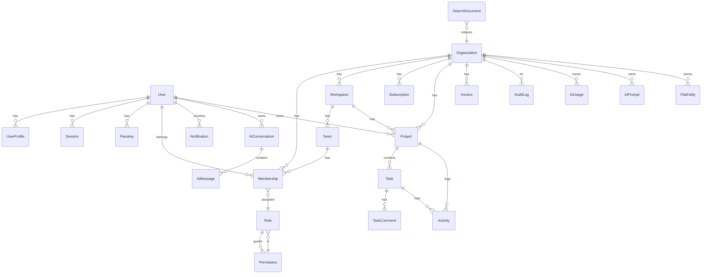

# Entity Relationship Diagram

## Key relationships

| Entity | Relations |
|--------|-----------|
| User | 1:1 UserProfile, 1:N Session, 1:N Passkey, 1:N Membership, 1:N Notification, 1:N AiConversation |
| Organization | 1:N Membership, 1:N Workspace, 1:N Subscription, 1:N Project, 1:N Invoice, 1:N AuditLog, 1:N File |
| Workspace | 1:N Team, 1:N Project |
| Team | 1:N Membership |
| Membership | N:1 Role, N:1 User, N:1 Organization, N:1 Team |
| Role | N:N Permission (via `role_permissions`) |
| Project | 1:N Task |
| Task | 1:N TaskComment, 1:N Activity |
| AiConversation | 1:N AiMessage |
